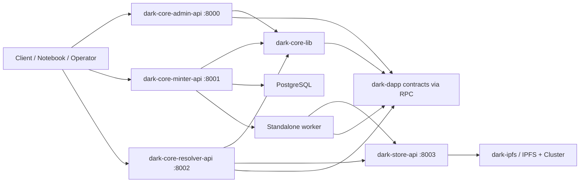

# dARK Stack Architecture

This document is the high-level technical map of the `dark-developer` monorepo and the services it orchestrates.

It is intended to answer:

- what each component does
- how the components relate to each other
- which APIs exist and what role they play
- how ARKs, Level-1 metadata, and Level-2 metadata move through the system
- how the default storage backend works today
- how the local developer installation is expected to run

The current architecture described here matches the stack as implemented in this workspace as of March 24, 2026.

---

## 1. Big Picture

The dARK stack is a modular system for minting, publishing, and resolving ARKs backed by blockchain and shared metadata storage.

At a high level:

- authorities are managed through the admin API
- ARKs are reserved and staged through the minter API
- publication is finalized by the minter worker
- blockchain stores the canonical ARK target URL and the Level-1 metadata CID
- Level-1 and Level-2 metadata are stored in shared external storage
- the resolver reads from blockchain plus shared storage and exposes public ARK resolution

The current default storage backend is:

- `dark-store-api` as the raw content storage service
- backed by `dark-ipfs` as the underlying IPFS + IPFS Cluster infrastructure

---

## 2. Repository Layout

Top-level structure:

```text
dark-developer/
├── install.py
├── README.md
├── ARCHITECTURE.md
├── notebooks/
└── components/
    ├── blockchain/
    │   ├── dark-env/
    │   ├── dark-dapp/
    │   ├── dark-explorador/
    │   └── dark-ipfs/
    ├── libraries/
    │   └── dark-core-lib/
    └── services/
        ├── dark-core-admin-api/
        ├── dark-core-minter-api/
        ├── dark-core-resolver-api/
        └── dark-store-api/
```

Important note:

- the root repository is an orchestrator and installer
- most components under `components/` are their own git repositories
- the root repo configures and wires them together

---

## 3. Main Components

### 3.1 Blockchain Layer

#### `components/blockchain/dark-env`

Purpose:

- local blockchain environment
- Docker network used by the stack
- RPC endpoint used by admin, minter, and resolver

Typical local endpoint:

- `http://localhost:8545`

#### `components/blockchain/dark-dapp`

Purpose:

- Solidity contracts for dARK
- on-chain source of truth for ARK existence and target resolution

What the chain stores for each ARK:

- ARK identity
- target URL
- Level-1 CID
- owner / authority-level ownership context
- timestamps

#### `components/blockchain/dark-explorador`

Purpose:

- local block explorer for development

Typical local endpoint:

- `http://localhost:25000`

#### `components/blockchain/dark-ipfs`

Purpose:

- default IPFS infrastructure backend for the stack
- 3-node Kubo cluster plus 3 IPFS Cluster peers

Typical host endpoints:

- IPFS API: `http://localhost:5001`
- IPFS Gateway: `http://localhost:8080`
- IPFS Cluster API: `http://localhost:9094`
- IPFS Cluster proxy: `http://localhost:9095`

Operational role:

- this is infrastructure, not a business API
- `dark-store-api` talks to it and exposes a simpler application-facing storage contract

---

### 3.2 Shared Library

#### `components/libraries/dark-core-lib`

Purpose:

- shared SDK for blockchain access and shared metadata logic
- common code used by admin, minter, and resolver

Responsibilities:

- read/write operations against dARK contracts
- ARK parsing and validation
- metadata schemas
- metadata storage adapters
- metadata orchestration helpers

Key concepts provided by the core library:

- `DARKCoreClient`
- ARK parsing helpers
- `MetadataService`
- storage backends:
  - `store_api`
  - `filesystem`

Current default storage behavior:

- `store_api` is the default backend
- `http://localhost:8003` is the default local store URL

---

### 3.3 Service Layer

#### `components/services/dark-core-admin-api`

Purpose:

- administrative service for authority lifecycle and NAAN authorization

Typical local endpoint:

- `http://localhost:8000`

Role in the stack:

- create authorities
- inspect authorities
- authorize NAANs to authorities
- expose operational admin status

This API is thin:

- it mainly delegates to `dark-core-lib`
- it does not own the ARK publication lifecycle

#### `components/services/dark-core-minter-api`

Purpose:

- private authoring and publication service
- manages the mutable lifecycle before data becomes canonical on-chain

Typical local endpoint:

- `http://localhost:8001`

Main responsibilities:

- reserve ARKs
- accept target + metadata updates
- keep local state in PostgreSQL
- run the publication worker
- publish finalized ARKs to blockchain

This is the component that owns lifecycle state:

- `RESERVED`
- `DRAFT`
- `UPDATE`
- `PUBLISHED`
- `TOMBSTONE`

Important:

- the minter is not the public resolver
- it is the write-side service

#### `components/services/dark-core-resolver-api`

Purpose:

- public read-only ARK resolution service

Typical local endpoint:

- `http://localhost:8002`

Main responsibilities:

- resolve ARKs to their target URL
- expose `?info` using Level-1 metadata
- expose `?metadata` using raw Level-2 metadata

Important constraints:

- it is read-only
- it has no worker
- it has no local lifecycle database
- it reads the chain as the canonical source of truth

#### `components/services/dark-store-api`

Purpose:

- shared raw content storage service used by minter and resolver

Typical local endpoint:

- `http://localhost:8003`

Main responsibilities:

- store raw bytes and return a CID
- retrieve raw bytes by CID
- expose storage status
- abstract away direct IPFS usage from application services

Important design rule:

- `dark-store-api` is intentionally simple
- it does not understand dARK metadata semantics
- it stores bytes only

The meaning of Level-1 and Level-2 lives in `dark-core-lib`, not in the store.

---

## 4. Data Model: ARK, L1, L2

The current metadata model is a two-level design.

### 4.1 Level-1 Metadata

Level-1 is always JSON.

It is the metadata document whose CID is published on-chain.

Level-1 includes:

- user-facing descriptive metadata
- a reference to the original Level-2 metadata

The Level-2 reference lives inside:

- `original_metadata`

Current `original_metadata` shape:

```json
{
  "schema": "oai_dc",
  "media_type": "application/xml",
  "cid": "bafy..."
}
```

Meaning:

- `schema`: logical schema label for the Level-2 source
- `media_type`: actual media type to use when serving Level-2
- `cid`: CID of the raw Level-2 bytes in shared storage

### 4.2 Level-2 Metadata

Level-2 is the original metadata payload as provided by the client.

Examples:

- XML
- JSON
- plain text
- potentially binary formats in the future

Important:

- Level-2 is stored raw
- the store does not reinterpret or transform it

### 4.3 Visibility Rules

For final users:

- the resolver hides internal CIDs
- `?info` must not expose internal storage references

For operators and internal tooling:

- minter responses and internal notebooks may use CIDs for verification and debugging

---

## 5. End-to-End Publication Flow

### 5.1 Authority Flow

1. Create authority in admin API
2. Authorize a NAAN for that authority
3. Confirm authorization from minter side

### 5.2 ARK Authoring Flow

1. Reserve an ARK in the minter
2. Submit:
   - target URL
   - Level-1 minimal metadata
   - Level-2 original metadata
   - `metadata_schema`
   - `metadata_media_type`
3. The minter stores local draft state in PostgreSQL
4. The worker picks up pending publication

### 5.3 Worker Publication Flow

The minter worker:

1. stores raw Level-2 in `dark-store-api`
2. receives `level2_cid`
3. injects `schema + media_type + cid` into `L1.original_metadata`
4. stores Level-1 JSON in `dark-store-api`
5. receives `level1_cid`
6. publishes the ARK to blockchain using:
   - target URL
   - `level1_cid`
7. marks the ARK as `PUBLISHED`

### 5.4 Resolver Flow

When a client resolves an ARK:

1. resolver parses the ARK
2. resolver reads the ARK from blockchain
3. default resolution redirects to the on-chain target
4. if `?info`, resolver reads Level-1 from shared storage
5. if `?metadata`, resolver:
   - reads Level-1 first
   - extracts `original_metadata.cid`
   - fetches Level-2 raw bytes
   - responds using `original_metadata.media_type`

---

## 6. Architecture Diagram



---

## 7. API Summary

This section is intentionally high-level. For full request and response shapes, consult the component-level READMEs and generated docs.

### 7.1 Admin API

Base URL:

- `http://localhost:8000`

Main endpoints:

- `GET /health`
- `GET /api/v1/admin/status`
- `POST /api/v1/admin/authority`
- `GET /api/v1/admin/authority/{uuid}`
- `POST /api/v1/admin/authority/{uuid}/authorize-naan`

Purpose:

- authority creation and authorization

---

### 7.2 Minter API

Base URL:

- `http://localhost:8001`

Main endpoints:

- `GET /health`
- `POST /api/v1/arks`
- `GET /api/v1/arks/{ark}`
- `PUT /api/v1/arks/{ark}`
- `DELETE /api/v1/arks/{ark}`
- `GET /api/v1/worker/status`
- `GET /api/v1/authority/{uuid}/naans`

Important write request fields when staging metadata:

- `target`
- `minimal_metadata`
- `original_metadata`
- `metadata_schema`
- `metadata_media_type`

Purpose:

- reserve ARKs
- stage metadata
- manage lifecycle
- expose worker status

---

### 7.3 Resolver API

Base URL:

- `http://localhost:8002`

Main endpoints:

- `GET /health`
- `GET /api/v1/arks/{ark}`
- `GET /api/v1/arks/{ark}?info`
- `GET /api/v1/arks/{ark}?metadata`

Behavior:

- default: redirect to target
- `?info`: Level-1 public projection
- `?metadata`: raw Level-2 payload

Important rule:

- CIDs remain hidden from public resolver responses

---

### 7.4 Store API

Base URL:

- `http://localhost:8003`

Main endpoints:

- `GET /health`
- `POST /v1/store`
- `GET /v1/retrieve/{cid}`
- `GET /v1/status/{cid}`

Behavior:

- stores raw bytes
- retrieves raw bytes
- exposes pin / replication status

What it does not do:

- it does not parse Level-1
- it does not infer Level-2 schema
- it does not decide the final media type served by the resolver

---

## 8. Storage Semantics

### 8.1 Why the store is raw

The current design intentionally keeps the storage service simple.

Reasons:

- simpler service contract
- easier to swap or test backends
- avoids duplicating metadata semantics between services
- keeps Level-1 as the canonical source for Level-2 interpretation

### 8.2 Why Level-1 carries Level-2 semantics

By keeping `schema + media_type + cid` in Level-1:

- the resolver can reconstruct how to serve Level-2
- the store stays generic
- the meaning of Level-2 is versioned with the published Level-1 document

### 8.3 Current default backend

Current default is:

- `METADATA_STORAGE_TYPE=store_api`
- `METADATA_STORE_API_URL=http://localhost:8003`

`filesystem` still exists as a fallback for local development and tests, but it is no longer the default operational path.

---

## 9. Installer and Local Runtime

The root installer is:

- `install.py`

Current installation order:

1. blockchain
2. core library
3. admin API
4. dark-ipfs
5. dark-store-api
6. resolver API
7. minter API

Generated integration environments:

- component-level `.env.integration` files are created by the installer
- the installer wires container-to-container URLs for Docker runtime

Current expected local ports:

- RPC: `8545`
- Explorer: `25000`
- Admin API: `8000`
- Minter API: `8001`
- Resolver API: `8002`
- Store API: `8003`
- IPFS API: `5001`
- IPFS Gateway: `8080`
- IPFS Cluster API: `9094`

---

## 10. Notebooks

Root notebooks are intended as operator-facing integration walkthroughs.

Important root notebook:

- `notebooks/dark_e2e_authority_to_resolver.ipynb`

That notebook currently covers:

- authority creation
- NAAN assignment
- ARK reservation
- Level-1 / Level-2 staging
- worker publication
- resolver redirect
- `?info`
- `?metadata`
- internal verification that Level-1 and Level-2 content are stored and reachable through IPFS

Component notebooks also exist inside component repositories for more focused testing.

---

## 11. Operational Boundaries

### 11.1 Source of truth

Canonical source of truth by concern:

- ARK target + Level-1 CID: blockchain
- authority administration: admin API + blockchain-backed core operations
- lifecycle workflow before publication: minter database
- raw metadata bytes: store backend

### 11.2 Public vs internal interfaces

Public-facing:

- resolver

Operator-facing:

- admin API
- minter API
- store API
- IPFS / cluster endpoints
- notebooks

### 11.3 Hidden implementation details

Public users should not need to know:

- Level-1 CID
- Level-2 CID
- storage backend choice
- minter internal lifecycle details

Those remain internal or operator-level concerns.

---

## 12. Common Failure Modes

### Resolver starts with wrong storage backend

Symptom:

- resolver container fails on startup

Typical cause:

- stale `.env.integration`
- wrong `METADATA_STORAGE_TYPE`
- host filesystem path leaking into a containerized resolver

Expected fix:

- resolver should default to `store_api`
- Docker runtime should use `http://store-api:8003`

### Content is readable from IPFS but `pinned=false`

Symptom:

- `ipfs cat` works
- store status does not show `pinned`

Typical cause:

- content was added to IPFS without being registered as a cluster pin

Expected behavior now:

- `dark-store-api` stores the content and registers the CID in IPFS Cluster

### Resolver `?metadata` returns wrong media type

Typical cause:

- missing or wrong `metadata_media_type` at staging time

Expected rule:

- media type for Level-2 must come from `L1.original_metadata.media_type`

---

## 13. Current Design Principles

The stack is currently built around these principles:

- blockchain is authoritative for ARK existence and target resolution
- Level-1 is always JSON and is the canonical interpretive layer
- Level-2 stays raw
- the store is generic
- public resolver responses hide storage internals
- shared semantics live in `dark-core-lib`
- infrastructure concerns are separated from business APIs

---

## 14. Recommended Reading Order

For someone onboarding to the stack:

1. `README.md`
2. this file: `ARCHITECTURE.md`
3. `components/libraries/dark-core-lib/README.md`
4. `components/services/dark-core-admin-api/README.md`
5. `components/services/dark-core-minter-api/README.md`
6. `components/services/dark-core-resolver-api/README.md`
7. `components/services/dark-store-api/README.md`
8. `components/blockchain/dark-ipfs/README.md`
9. `notebooks/dark_e2e_authority_to_resolver.ipynb`

---

## 15. Short Mental Model

If you only remember one sentence, remember this:

> The minter writes, the worker publishes, the blockchain points to Level-1, Level-1 points to Level-2, the store keeps raw bytes, and the resolver reads everything back without exposing internal CIDs to the public.
