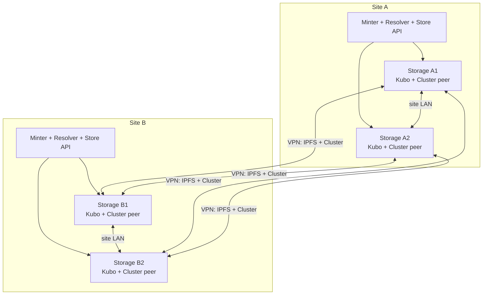

# IPFS Architecture — Global Multi-Site Cluster

## Status

| Field | Value |
| --- | --- |
| Decision | One global IPFS Cluster distributed across all sites |
| Consensus | CRDT |
| Storage nodes per site | Two |
| Status | Approved design; implementation pending |
| Scope | Production storage, Store API integration, deployment and operations |

This document defines the target IPFS architecture for dARK. It supersedes the
idea of independent clusters per site and the alternative in which Store API
instances implement their own cross-site replication protocol.

The current `dark-ipfs` Compose stack remains a local simulation. Production
will run one Kubo daemon and one IPFS Cluster peer on each storage server.

## 1. Decision summary

dARK will operate one logical IPFS Cluster across every participating site:

```text
One global cluster
├── Site A
│   ├── storage-a-1: Kubo + Cluster peer
│   └── storage-a-2: Kubo + Cluster peer
├── Site B
│   ├── storage-b-1: Kubo + Cluster peer
│   └── storage-b-2: Kubo + Cluster peer
└── Site N
    ├── storage-n-1: Kubo + Cluster peer
    └── storage-n-2: Kubo + Cluster peer
```

The two peers in a site communicate directly over the local network. All peers
also communicate with peers in other sites over the private VPN. A site is an
allocation and operational label; it is not a separate or nested cluster.

All Cluster peers share:

- one `cluster_name`;
- one Cluster network secret;
- one CRDT pinset;
- one replication policy;
- an explicit set of trusted peer IDs.

Every Cluster and Kubo peer keeps a unique persistent identity.

## 2. Goals

The architecture must:

- keep two storage nodes in every healthy site;
- tolerate the loss of one storage server without losing read availability;
- continue minting after one server fails when the configured write quorum is
  still available;
- preserve reads when an entire site disappears;
- with three or more sites, continue minting after one complete site loss;
- allow deployment to begin with one site and expand the same cluster later;
- keep Store API, Minter and Resolver dependent only on local site endpoints;
- keep all IPFS and Cluster traffic on private networks;
- avoid custom Store API-to-Store API replication protocols.

## 3. Non-goals

This decision does not solve:

- active-active blockchain nonce management between Minters;
- global HTTP routing between application sites;
- backup retention against an authorized or accidental global `unpin`;
- VPN provisioning itself;
- blockchain validator placement.

Multiple Minters using the same blockchain wallet still require exclusive
writer coordination or a separate signer design.

## 4. Site topology



Each storage server runs exactly two persistent services:

```text
Kubo
IPFS Cluster peer
```

Store API runs in the application tier. It uses both local storage servers for
endpoint failover, but does not call Store APIs in other sites.

## 5. Network layers

There are two independent libp2p networks:

1. The Kubo swarm transfers content blocks.
2. The IPFS Cluster swarm distributes the CRDT pinset, metrics and allocation
   decisions.

Each Cluster peer controls only its paired Kubo daemon:

```text
Cluster A1 -> Kubo A1
Cluster A2 -> Kubo A2
Cluster B1 -> Kubo B1
Cluster B2 -> Kubo B2
```

Required connectivity over the VPN:

| Port | Protocol | Source and destination | Purpose |
| ---: | --- | --- | --- |
| `4001` | TCP/UDP | Every Kubo to every Kubo | IPFS block transfer |
| `9096` | TCP/UDP | Every Cluster peer to every Cluster peer | Cluster swarm |

Site-local or application-network access:

| Port | Consumer | Purpose |
| ---: | --- | --- |
| `5001` | Paired Cluster peer and local Store API | Kubo RPC |
| `9094` | Local Store API and operators | Cluster REST/status |
| `9095` | Local Store API | Cluster Proxy add path |
| `8003` | Local Minter and Resolver | Store API |

Kubo RPC and Cluster management APIs must not be exposed to the public
Internet. The VPN/firewall must permit direct peer connectivity without making
administrative APIs globally accessible.

## 6. Private networks and secrets

All Kubo nodes join one private swarm using a shared swarm key. All Cluster
peers join one private Cluster network using a separate Cluster secret:

```ini
IPFS_SWARM_KEY_FILE=/run/secrets/ipfs-swarm.key
IPFS_CLUSTER_SECRET_FILE=/run/secrets/ipfs-cluster-secret
```

These files are common to every site, distributed outside Git, mounted
read-only and stored with restrictive permissions. Kubo supports private swarm
keys through `IPFS_SWARM_KEY_FILE` in its Docker image.

References:

- [Kubo in Docker and private swarms](https://docs.ipfs.tech/install/run-ipfs-inside-docker/)
- [IPFS Cluster security and trusted peers](https://ipfscluster.io/documentation/guides/security/)

There is no mTLS, bearer token or replication endpoint between Store API
instances because Store APIs never communicate across sites.

## 7. Peer identity and discovery

Peer names encode site and node identity:

```text
site-a-storage-1
site-a-storage-2
site-b-storage-1
site-b-storage-2
```

The following paths are persistent and unique per server:

```text
/data/ipfs
/data/ipfs-cluster
```

Operators must never copy Kubo or Cluster identity data from one active peer to
another.

CRDT has no leader. Bootstrap peers are discovery entrypoints only. Every peer
is configured with at least:

- its local site partner;
- one bootstrap address in another site;
- preferably a second remote bootstrap address in a different failure domain.

Example Cluster peer addresses:

```text
/ip4/10.200.1.11/tcp/9096/p2p/<cluster-peer-a1>
/ip4/10.200.2.11/tcp/9096/p2p/<cluster-peer-b1>
```

Kubo removes public bootstrap defaults and uses only controlled peers. The
official Kubo documentation describes custom bootstrap lists for private
networks: [Modify the bootstrap list](https://docs.ipfs.tech/how-to/modify-bootstrap-list/).

## 8. Replication policy

For `N` sites with two peers per site:

```text
expected peer count = 2 * N
```

### 8.1 Multi-site production

```ini
CLUSTER_REPLICATION_MIN=3
CLUSTER_REPLICATION_MAX=<2 * N>
CLUSTER_DISABLE_REPINNING=false
STORE_WRITE_MIN_PEERS=3
STORE_WRITE_MIN_SITES=2
```

Because no site has more than two peers, three pinned peers necessarily span at
least two sites. Store API nevertheless verifies both peer and site counts to
detect topology errors.

Examples:

| Sites | Expected peers | Minimum | Maximum |
| ---: | ---: | ---: | ---: |
| 2 | 4 | 3 | 4 |
| 3 | 6 | 3 | 6 |
| 4 | 8 | 3 | 8 |

Cluster attempts to allocate up to the maximum and accepts a pin allocation
when the minimum can be fulfilled. Store API adds a stronger application gate:
it waits for actual `PINNED` status on the required number of peers and sites
before allowing Minter to publish the CID.

Reference: [IPFS Cluster replication factors](https://ipfscluster.io/documentation/guides/pinning/).

### 8.2 Single-site availability profile

The same global cluster can begin with one site and two peers:

```ini
CLUSTER_REPLICATION_MIN=1
CLUSTER_REPLICATION_MAX=2
STORE_WRITE_MIN_PEERS=1
STORE_WRITE_MIN_SITES=1
```

With both peers healthy, every CID targets two copies. If one server fails,
reads and minting continue with one copy and reconciliation restores the second
copy after recovery.

This profile prioritizes availability. It cannot guarantee two copies while
only one server is alive.

An optional strict single-site profile can require two peers:

```ini
CLUSTER_REPLICATION_MIN=2
CLUSTER_REPLICATION_MAX=2
STORE_WRITE_MIN_PEERS=2
STORE_WRITE_MIN_SITES=1
```

That profile pauses minting when either server fails.

### 8.3 Growing from one site to two

The cluster is not recreated. Two new peers join the existing CRDT cluster,
then configuration changes from `min=1/max=2` to `min=3/max=4`. Historical
pins are reconciled so that the new site receives both copies.

## 9. Allocation by site

Peers publish site tags:

```json
{
  "tags": {
    "site": "site-a",
    "node": "1"
  }
}
```

The balanced allocator uses:

```json
{
  "allocate_by": [
    "tag:site",
    "freespace"
  ]
}
```

When every peer is healthy and `replication_max` equals the expected peer
count, all peers receive allocations. Tags become especially useful when some
peers are unavailable or a future policy stores fewer than all possible
copies.

Reference: [IPFS Cluster configuration and allocators](https://ipfscluster.io/documentation/reference/configuration/).

## 10. Write path

The preferred write path remains Cluster Proxy:

```text
Minter
  -> local Store API
  -> local Cluster Proxy /api/v0/add?cid-version=1&pin=true
  -> paired Kubo receives content
  -> global Cluster allocates and distributes the pin
  -> remote Kubo peers fetch blocks over the VPN
  -> Store API verifies replication quorum
  -> Minter publishes the CID on-chain
```

Store API must not treat CID creation alone as durable success. It returns a
successful storage response only after:

```text
pinned peers >= STORE_WRITE_MIN_PEERS
pinned sites >= STORE_WRITE_MIN_SITES
```

Example durable response:

```json
{
  "cid": "bafy...",
  "size": 14520,
  "replication": {
    "status": "durable",
    "pinned_peers": 3,
    "pinned_sites": 2,
    "target_peers": 6
  }
}
```

If quorum is not reached before the configured timeout, Store API returns a
retryable `503`. A partial pin may remain, but Minter must not publish its CID.
Retrying the same immutable content is safe because it produces the same CID
when import parameters are unchanged.

CRDT batching remains disabled initially so a restart cannot discard an
unbroadcast batch. It can be evaluated later if pin ingestion becomes a
measured bottleneck.

## 11. Local endpoint failover

Store API knows both local storage servers:

```ini
IPFS_API_URLS_JSON=[
  "http://10.200.1.11:5001",
  "http://10.200.1.12:5001"
]

IPFS_CLUSTER_API_URLS_JSON=[
  "http://10.200.1.11:9094",
  "http://10.200.1.12:9094"
]

IPFS_CLUSTER_PROXY_URLS_JSON=[
  "http://10.200.1.11:9095",
  "http://10.200.1.12:9095"
]
```

For a new request, Store API selects a healthy local endpoint. If connection
fails before the upload completes, it retries the complete request against the
other local proxy. It does not switch endpoints in the middle of a streaming
upload.

## 12. Read path

Resolver always uses its site-local Store API:

```text
Resolver
  -> local Store API
  -> local Kubo A1
  -> local Kubo A2 on failure
  -> private IPFS swarm fetch when content is not local
```

Store API does not need remote Store API addresses. A healthy Kubo can retrieve
blocks from any provider peer in the global private swarm.

Reads must not create ad-hoc local pins outside Cluster allocation. Persistent
repair belongs to Cluster recovery and the reconciler.

## 13. Health model

Store API exposes separate health dimensions:

| Endpoint | Meaning | Consumer |
| --- | --- | --- |
| `/health/live` | Process is running | Container runtime |
| `/health/read` | At least one local Kubo is usable | Resolver/load balancer |
| `/health/write` | Local proxy plus required peers/sites are available | Minter |

Write readiness requires:

```text
at least one local Kubo
at least one local Cluster Proxy
healthy peers >= STORE_WRITE_MIN_PEERS
healthy sites >= STORE_WRITE_MIN_SITES
```

Read readiness does not require the global write quorum.

## 14. Failure behavior

| Failure | Reads | Minting |
| --- | --- | --- |
| One storage peer | Continue through the local partner | Continues when quorum remains |
| One site, with two total sites | Continue in the surviving site | Pauses because only two peers remain |
| One site, with three or more sites | Continue | Continues with at least four peers |
| One site isolated alone by VPN | Local reads continue | Pauses because it sees only two peers |
| Partition containing two or more sites | Continue | May continue if peer/site quorum is met |
| Store API process failure | That application site is unavailable | Another application site must serve traffic |

An isolated site must not lower quorum automatically. Degraded policies require
an explicit operator decision.

Because content and pins are treated as append-only, CRDT partitions can
converge by merging pin additions after connectivity returns. Automatic global
`unpin` is outside the supported operational model.

## 15. Reconciliation

Cluster retries failed pins that remain allocated to a recovered peer. A
different case occurs when a peer or site was absent while new pins were
created: those pins may not include the recovered peer in their allocations.

The deployer will provide:

```bash
python3 install.py storage reconcile
```

The command will:

1. inspect the global pinset;
2. reapply the configured minimum and maximum to existing pins;
3. preserve existing valid allocations;
4. request missing allocations for recovered or newly added peers;
5. report `PINNING`, `PIN_ERROR` and under-replicated CIDs;
6. never remove pins.

It runs after:

- a site recovery;
- adding storage peers;
- changing replication factors;
- increasing the site count;
- and periodically as an operational audit.

## 16. Adding a site

The controlled procedure is:

1. provision VPN addresses for two storage servers;
2. create unique Kubo and Cluster identities;
3. mount the existing swarm key and Cluster secret;
4. configure local and remote bootstrap addresses;
5. start Kubo, then Cluster;
6. verify both peers in the global peerset;
7. update expected peer count and `replication_max` on all peers;
8. execute reconciliation;
9. wait until historical CIDs have two copies in the new site;
10. enable the site's Store API, Resolver and Minter traffic.

Adding a site does not create a new cluster and does not change existing CIDs.

## 17. Maintenance and upgrades

Storage servers are upgraded one at a time:

1. verify write quorum;
2. stop one peer pair;
3. upgrade and restart it;
4. wait for Kubo and Cluster recovery;
5. verify replication state;
6. continue with the next server.

With two sites and four peers, taking one peer offline leaves three and permits
minting. Taking two peers offline leaves only two and pauses minting under the
multi-site policy.

## 18. Monitoring and alerts

Required metrics:

- healthy peer count;
- healthy site count;
- pins below minimum and maximum;
- `PIN_ERROR` and pin queue depth;
- free disk space and repository size per Kubo;
- VPN reachability and latency per site;
- time to reach durable quorum;
- time to reach full replication;
- expected versus observed peers.

Minimum alerts:

```text
critical: healthy peers < configured minimum
critical: healthy sites < configured minimum
warning: any pin below replication maximum
warning: any PIN_ERROR persists
warning: free disk < 20%
warning: expected peer absent
```

## 19. Backups and destructive operations

Replication is not a backup against an authorized global deletion. Operational
policy therefore requires:

- no automatic unpin endpoint exposed through Store API;
- backups of Cluster configuration and secrets;
- protected copies of the pin inventory;
- periodic content recovery tests;
- optional offline CAR exports for disaster recovery.

The official Cluster recovery guide explains how peers restore their CRDT state
from a healthy cluster: [Data, backups and recovery](https://ipfscluster.io/documentation/guides/backups/).

## 20. Required implementation changes

### `dark-ipfs`

- replace the multi-peer single-host production layout with one Kubo/Cluster
  pair per server;
- support persistent unique identities;
- support private swarm and Cluster secret files;
- configure VPN-only addresses and bootstrap peers;
- publish site tags;
- expose configurable replication factors.

### `dark-store-api`

- accept ordered lists of local Kubo, Cluster REST and Proxy endpoints;
- fail over between local endpoints;
- wait for actual pinned peer/site quorum;
- expose separate read and write health;
- return replication state with the stored CID.

### `dark-deployer`

- add a `storage-node` installation role;
- accept `SITE_ID`, `NODE_ID` and a topology registry;
- install one storage pair per server;
- validate exactly two expected peers per site;
- calculate or validate `replication_max = 2 * N`;
- generate Store API endpoint lists;
- add `storage reconcile` and storage audit commands;
- make restart/status checks topology-aware;
- document single-site and multi-site profiles.

## 21. Acceptance scenarios

The implementation is complete only when automated or documented integration
tests prove:

1. one site stores and retrieves with two healthy peers;
2. single-site availability mode continues with one peer;
3. adding a second site preserves all historical CIDs;
4. two-site production continues after one server fails;
5. two-site production pauses minting after a complete site loss;
6. three-site production continues after a complete site loss;
7. an isolated single site reads but cannot mint;
8. healed sites receive pins created during their absence;
9. Store API fails over between its two local proxies;
10. no administrative IPFS/Cluster API is publicly reachable.

## 22. Rationale and rejected alternatives

### Independent cluster per site

Rejected because it requires a custom cross-site replication and confirmation
protocol, separate pinsets, additional authentication and a repair catalog.

### Kubo-only storage servers

Rejected as the primary design because Store API would need to reimplement pin
allocation, quorum, status, repair and peer lifecycle. It saves one process per
server but increases overall application complexity.

### Store API-to-Store API replication

Rejected because the global Cluster pinset already solves distribution. The
chosen design requires no mTLS, bearer token or internal replication endpoint
between Store APIs.

### Raft consensus

Rejected because it requires a majority and is less suitable for peers and
sites that may disconnect. CRDT is the recommended IPFS Cluster mode for this
deployment model.

## 23. Final policy

```text
Cluster topology:             one global cluster
Consensus:                    CRDT
Storage peers per site:       two
Production minimum sites:     two
Multi-site replication min:   three peers
Multi-site replication max:   all expected peers (2 * N)
Pre-mint durability gate:     three pinned peers in two sites
Single-site availability:     one minimum, two target peers
Kubo network:                 private swarm over VPN
Cluster network:              private swarm over VPN
Store API scope:              local endpoints only
Cross-site Store API control: none
Automatic unpin:              forbidden
Reconciliation:               periodic and after topology changes
```
