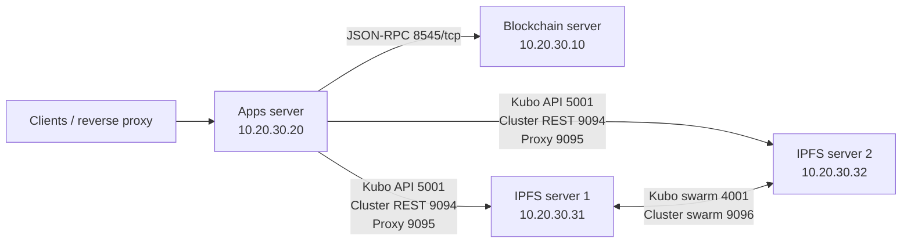

# Production installation: one blockchain, one apps, and two IPFS servers

This runbook installs the current `main` version on four
physical or virtual servers in one private local network:

- one blockchain server;
- one application server;
- two independent IPFS storage servers;
- one IPFS Cluster site named `site-a` containing both storage peers.

The examples use `10.20.30.0/24`. Replace every example address with the real,
static address from the deployment worksheet before running the installer.
Do not mix example and real addresses.

> **Production-readiness warning:** this topology tolerates the loss of one
> IPFS server. It does not tolerate the loss of the blockchain server or the
> apps server. The blockchain server runs four Besu containers, but all four
> share one physical failure domain. See [Availability boundaries](#3-availability-boundaries)
> and [Current signer compatibility requirement](#14-current-signer-compatibility-requirement).

## 1. Resulting topology



The apps server runs Core Admin API, Store API, Resolver API, Minter API and
the optional dashboard. Store API tries both local IPFS servers. With both
storage peers healthy, each CID is allocated to both. With one storage server
down, reads and minting can continue with the remaining copy; reconciliation
restores the second copy after recovery.

## 2. Deployment worksheet

Complete this table before touching any host. The addresses must be static or
DHCP-reserved for the lifetime of the deployment.

| Role | Example hostname | Example IPv4 | Install role |
| --- | --- | ---: | --- |
| Blockchain | `dark-chain-01.lan` | `10.20.30.10` | `blockchain` |
| Applications | `dark-apps-01.lan` | `10.20.30.20` | `apps` |
| IPFS peer 1 | `dark-ipfs-01.lan` | `10.20.30.31` | `storage-node` |
| IPFS peer 2 | `dark-ipfs-02.lan` | `10.20.30.32` | `storage-node` |
| Default gateway | — | `10.20.30.1` | — |
| DNS/NTP | site-specific | site-specific | — |

Use IP addresses, not hostnames, in `storage-topology.json`. The topology
validator currently requires IPv4 in `vpn_address`. The field retains the name
`vpn_address` because it also supports multi-site VPN deployments; in this
single-LAN installation it contains the server's private LAN address.

### 2.1 Exactly where each address is configured

| Address | Where it must be entered |
| --- | --- |
| Blockchain `10.20.30.10` | Blockchain host OS network configuration; blockchain root `.env` as `RPC_URL=http://10.20.30.10:8545`; LAN firewall rules. It is then propagated to apps through `.env.integration`. |
| Apps `10.20.30.20` | Apps host OS network configuration; DNS/hosts records; firewall source/destination rules. It is not a storage topology peer. |
| IPFS 1 `10.20.30.31` | IPFS 1 host OS network configuration; both peer entries copied into `storage-topology.json` on apps and both IPFS hosts; firewall rules. IPFS 1 root `.env` selects `site-a-storage-1`. |
| IPFS 2 `10.20.30.32` | IPFS 2 host OS network configuration; both peer entries copied into `storage-topology.json` on apps and both IPFS hosts; firewall rules. IPFS 2 root `.env` selects `site-a-storage-2`. |
| Gateway and DNS | Host OS network configuration only; they do not belong in deployer `.env` or the storage topology. |

On Ubuntu, static addressing belongs in the site's normal Netplan or
cloud-init/network-management layer. Configure the OS address before cloning
the deployer. Do not try to make Docker Compose assign the physical server IP.
The storage Compose stack binds its published ports to the `vpn_address`
selected from the topology.

Optional local DNS records are still recommended for SSH and operations. If
DNS is unavailable, add the same records to `/etc/hosts` on all four servers:

```text
10.20.30.10 dark-chain-01.lan dark-chain-01
10.20.30.20 dark-apps-01.lan  dark-apps-01
10.20.30.31 dark-ipfs-01.lan  dark-ipfs-01
10.20.30.32 dark-ipfs-02.lan  dark-ipfs-02
```

Verify from every host before installation:

```bash
ping -c 2 10.20.30.10
ping -c 2 10.20.30.20
ping -c 2 10.20.30.31
ping -c 2 10.20.30.32
```

## 3. Availability boundaries

| Failure | Expected result |
| --- | --- |
| IPFS server 1 fails | Store API fails over to IPFS server 2; metadata reads and new writes remain available. |
| IPFS server 2 fails | Store API fails over to IPFS server 1; metadata reads and new writes remain available. |
| Both IPFS servers fail | Metadata writes and reads fail. Blockchain data remains available. |
| Apps server fails | Admin, Store, Resolver and Minter APIs become unavailable. IPFS and blockchain keep running. |
| Blockchain server fails | New blockchain transactions and blockchain-backed resolution fail. IPFS content remains stored. |
| Entire LAN/site fails | The service is unavailable. Add another site to the same global Cluster for site-loss tolerance. |

The single-site replication policy is:

```text
replication minimum:      1 peer
replication target/max:   2 peers
pre-mint write gate:      1 pinned peer in 1 site
```

This favors availability during one storage-server failure. A successful mint
during that failure initially has one copy, not two. Monitor and reconcile it
after the failed peer returns.

## 4. Host requirements

The recommended baseline is x86-64 Ubuntu 24.04 LTS or an equivalent Linux
distribution with:

- at least 4 CPU cores and 8 GiB RAM on blockchain and apps;
- at least 2 CPU cores and 4 GiB RAM on each IPFS server;
- SSD-backed persistent storage;
- Python 3.12 and `python3.12-venv`;
- Git, `jq`, OpenSSL and CA certificates;
- Docker Engine and the Docker Compose v2 plugin;
- reliable NTP and internal DNS;
- outbound HTTPS/SSH access to the configured Git repositories and container
  registries during installation.

Size disks from measured blockchain growth and retained IPFS content. Do not
use ephemeral OS disks for Docker data.

On Ubuntu 24.04, install the non-Docker prerequisites on every server:

```bash
sudo apt-get update
sudo apt-get install -y \
  ca-certificates curl git jq netcat-openbsd openssl \
  python3.12 python3.12-venv
```

Install Docker Engine and the Compose v2 plugin using the organization's
approved package source. Do not substitute legacy `docker-compose` v1.

On every server, create a dedicated operator and repository location. The
examples use user `dark` and path `/opt/dark-deployer`:

```bash
sudo useradd --create-home --shell /bin/bash dark
sudo usermod -aG docker dark
sudo install -d -m 0750 -o dark -g dark /opt/dark-deployer
sudo install -d -m 0700 -o dark -g dark /opt/dark-secrets
```

If `dark` already exists, skip `useradd`. Log out and back in after adding the
Docker group, then verify as `dark`:

```bash
python3.12 --version
docker info
docker compose version
git --version
jq --version
```

Membership in the Docker group is effectively root-equivalent. Restrict SSH
access to the `dark` account and use individual operator accounts plus `sudo`
where organizational policy requires stronger attribution.

## 5. Network and firewall policy

Apply controls both at the host and at the LAN firewall or hypervisor security
group. Docker-published ports may bypass a simplistic UFW policy; do not rely
on UFW alone. None of the IPFS administrative APIs should be Internet-facing.

### 5.1 Required flows

| Source | Destination | Ports | Purpose |
| --- | --- | --- | --- |
| Apps `10.20.30.20` | Blockchain `10.20.30.10` | `8545/tcp` | Besu JSON-RPC |
| Apps `10.20.30.20` | Blockchain `10.20.30.10` | `8546/tcp` optional | Besu WebSocket RPC |
| Apps `10.20.30.20` | IPFS 1 and 2 | `5001/tcp` | Kubo API and peer identity discovery |
| Apps `10.20.30.20` | IPFS 1 and 2 | `9094/tcp` | Cluster REST status/control |
| Apps `10.20.30.20` | IPFS 1 and 2 | `9095/tcp` | Cluster proxy content writes |
| IPFS 1 | IPFS 2 | `4001/tcp+udp` | Private Kubo swarm |
| IPFS 1 | IPFS 2 | `9096/tcp+udp` | CRDT Cluster swarm |
| IPFS 1 | IPFS 2 | `5001/tcp`, `9094/tcp` | Bootstrap identity discovery |
| Approved clients/proxy | Apps `10.20.30.20` | `8000-8002/tcp` | Admin, Minter and Resolver APIs |
| Approved operators | Apps `10.20.30.20` | `8003/tcp` | Store API operations/docs; not normally public |
| Approved users/proxy | Apps `10.20.30.20` | `8081/tcp` optional | Current dashboard |
| Approved operators | Blockchain `10.20.30.10` | `25000/tcp` optional | Block explorer |
| Operators | All servers | `22/tcp` | SSH |

Besu ports `30303-30306/tcp+udp` are published by the current Compose file but
are not required between these four physical servers: the four Besu containers
peer over their own Docker network. Block them at the LAN/perimeter unless an
external Besu peer is intentionally added.

The dashboard currently also publishes MySQL on `3307/tcp` and Redis on
`6380/tcp`. Block both from the LAN. Minter PostgreSQL is bound to loopback on
host port `5433/tcp`.

### 5.2 Connectivity checks before installation

After firewall rules are applied and before starting services, use `nc` from
the expected source host. A refused connection is normal until the service is
started; a timeout after startup indicates routing or firewall trouble.

```bash
# From the apps server, after the target services start:
nc -vz 10.20.30.10 8545
nc -vz 10.20.30.31 5001
nc -vz 10.20.30.31 9094
nc -vz 10.20.30.31 9095
nc -vz 10.20.30.32 5001
nc -vz 10.20.30.32 9094
nc -vz 10.20.30.32 9095
```

## 6. Clone the exact deployer version

Run this as `dark` on all four servers:

```bash
cd /opt
git clone --branch main \
  https://github.com/LA-Referencia-IOI/dark-deployer.git dark-deployer
cd /opt/dark-deployer
git status --short --branch
cp .env.example .env
chmod 600 .env
```

The expected branch is `main`. Before a formal production
rollout, prefer a reviewed release tag or an immutable commit instead of a
floating feature branch. Keep the same deployer revision on all four servers.

## 7. Create the shared storage topology

Create `/opt/dark-deployer/storage-topology.json` on the apps server and both
IPFS servers. The files must be byte-for-byte identical. The blockchain server
does not consume this file.

```json
{
  "version": 1,
  "cluster_name": "dark-production",
  "strict_single_site": false,
  "sites": [
    {
      "id": "site-a",
      "peers": [
        {
          "id": "site-a-storage-1",
          "vpn_address": "10.20.30.31",
          "ipfs_api_url": "http://10.20.30.31:5001",
          "cluster_api_url": "http://10.20.30.31:9094",
          "cluster_proxy_url": "http://10.20.30.31:9095"
        },
        {
          "id": "site-a-storage-2",
          "vpn_address": "10.20.30.32",
          "ipfs_api_url": "http://10.20.30.32:5001",
          "cluster_api_url": "http://10.20.30.32:9094",
          "cluster_proxy_url": "http://10.20.30.32:9095"
        }
      ]
    }
  ]
}
```

Do not set `development_single_node` in production. Do not use
`strict_single_site: true` for the requested availability behavior: strict mode
would require both peers before accepting a write and would therefore stop
minting when either IPFS server fails.

Validate the copied files without printing secrets:

```bash
cd /opt/dark-deployer
python3.12 -m json.tool storage-topology.json >/dev/null
sha256sum storage-topology.json
```

The SHA-256 value must match on apps, IPFS 1 and IPFS 2.

## 8. Generate and distribute IPFS secrets

Generate these secrets once, preferably on a controlled administrative host.
Both IPFS servers must receive the same two files. The apps and blockchain
servers do not need them.

```bash
umask 077
{
  printf '%s\n' '/key/swarm/psk/1.0.0/'
  printf '%s\n' '/base16/'
  openssl rand -hex 32
} > /opt/dark-secrets/ipfs-swarm.key
openssl rand -hex 32 > /opt/dark-secrets/ipfs-cluster-secret
chmod 600 /opt/dark-secrets/ipfs-swarm.key
chmod 600 /opt/dark-secrets/ipfs-cluster-secret
```

Copy them directly to IPFS 1 and IPFS 2 using the organization's approved
secret-transfer channel. With SSH, copy to a temporary owner-only directory and
then place them at these exact paths:

```text
/opt/dark-secrets/ipfs-swarm.key
/opt/dark-secrets/ipfs-cluster-secret
```

On each IPFS server verify ownership, mode and checksum:

```bash
stat -c '%U:%G %a %n' /opt/dark-secrets/ipfs-*
sha256sum /opt/dark-secrets/ipfs-swarm.key \
  /opt/dark-secrets/ipfs-cluster-secret
```

Expected ownership is `dark:dark` and mode is `600`. The two checksums must
match between IPFS 1 and IPFS 2. Never paste either file into `.env`, Git,
tickets, chat, or command output captured by CI.

## 9. Install the blockchain server

### 9.1 Why the Admin wallet is prepared first

The account that deploys `Authority.sol` becomes the only contract Admin. The
Admin API must use that same account. The normal `dark-env` setup generates a
funded master wallet, so this runbook pre-creates that wallet before the main
installer, then points `ADMIN_PRIVATE_KEY_FILE` to the same raw key. This avoids
deploying the contract with one account and starting Admin API with a different,
unauthorized account.

### 9.2 Pre-create the funded contract/Admin wallet

Run on `10.20.30.10` as `dark`:

```bash
cd /opt/dark-deployer
git clone --branch master \
  https://github.com/LA-Referencia-IOI/dark-env \
  components/blockchain/dark-env
cd components/blockchain/dark-env
chmod +x setup.sh scripts/*.sh
./scripts/create-master-wallet.sh
```

The script creates:

```text
/opt/dark-deployer/components/blockchain/dark-env/master-wallet.txt
/opt/dark-deployer/components/blockchain/dark-env/config/master-wallet
```

Both are required. The first contains the private key; the second contains only
the address that will receive the genesis balance. Extract the raw private key
to the path used by the installer without printing it:

```bash
cd /opt/dark-deployer
umask 077
sed -n 's/^[[:space:]]*Private Key[[:space:]]*:[[:space:]]*//p' \
  components/blockchain/dark-env/master-wallet.txt | head -n 1 \
  > /opt/dark-secrets/admin.key
chmod 600 /opt/dark-secrets/admin.key
```

Create a different temporary Minter role key. This branch requires distinct
Admin and Minter values during production validation:

```bash
umask 077
printf '0x%s\n' "$(openssl rand -hex 32)" \
  > /opt/dark-secrets/minter.key
chmod 600 /opt/dark-secrets/minter.key
```

Check only structure and equality, never print the values:

```bash
python3.12 - <<'PY'
from pathlib import Path

paths = [Path('/opt/dark-secrets/admin.key'), Path('/opt/dark-secrets/minter.key')]
values = [path.read_text().strip().removeprefix('0x') for path in paths]
assert all(len(value) == 64 for value in values)
assert all(int(value, 16) > 0 for value in values)
assert values[0] != values[1]
print('Signer files are structurally valid and distinct.')
PY
```

### 9.3 Blockchain `.env`

Edit `/opt/dark-deployer/.env` on `10.20.30.10`. Keep the remaining component
settings from `.env.example`, and set at least these values:

```dotenv
TYPE=production
CHAIN_ID=2025
RPC_URL=http://10.20.30.10:8545

# dark-env's master wallet remains the deployer. Admin points to the same key.
DEPLOYER_PRIVATE_KEY=
DEPLOYER_PRIVATE_KEY_FILE=
ADMIN_PRIVATE_KEY=
ADMIN_PRIVATE_KEY_FILE=/opt/dark-secrets/admin.key
MINTER_PRIVATE_KEY=
MINTER_PRIVATE_KEY_FILE=/opt/dark-secrets/minter.key

PRODUCTION_INSTALL_COMPONENTS=blockchain

PRODUCTION_BLOCKCHAIN_DARK_ENV_REPOSITORY_URL=https://github.com/LA-Referencia-IOI/dark-env
PRODUCTION_BLOCKCHAIN_DARK_ENV_REPOSITORY_BRANCH=master
PRODUCTION_BLOCKCHAIN_DARK_ENV_SETUP=True
PRODUCTION_BLOCKCHAIN_DARK_ENV_COMMANDS_JSON=["chmod +x setup.sh","chmod +x scripts/*.sh","./setup.sh","docker compose up -d"]

PRODUCTION_BLOCKCHAIN_DARK_DAPP_REPOSITORY_URL=https://github.com/LA-Referencia-IOI/dark-dapp
PRODUCTION_BLOCKCHAIN_DARK_DAPP_REPOSITORY_BRANCH=main
PRODUCTION_BLOCKCHAIN_DARK_DAPP_SETUP=True

PRODUCTION_BLOCKCHAIN_DARK_EXPLORADOR_REPOSITORY_URL=https://github.com/LA-Referencia-IOI/dark-explorer.git
PRODUCTION_BLOCKCHAIN_DARK_EXPLORADOR_REPOSITORY_BRANCH=master
PRODUCTION_BLOCKCHAIN_DARK_EXPLORADOR_SETUP=True
PRODUCTION_BLOCKCHAIN_DARK_EXPLORADOR_COMMANDS_JSON=["docker compose up -d --build","docker compose up -d"]

PRODUCTION_BLOCKCHAIN_HOST=
PRODUCTION_DARK_CONTRACT_ADDRESS=
PRODUCTION_AUTHORITY_CONTRACT_ADDRESS=
```

`RPC_URL` must contain the blockchain server's LAN address, not `localhost`.
The generated handoff copies this value to the apps server, where `localhost`
would incorrectly refer to the apps server.

### 9.4 Validate, plan and install

```bash
cd /opt/dark-deployer
python3.12 install.py validate
python3.12 install.py plan
python3.12 install.py
```

Choose:

```text
Profile:     [3] Production
Components:  [3] Blockchain only
Confirm:     Y
```

The installer reuses the pre-created `dark-env` checkout and wallet, starts the
four-node QBFT network, deploys contracts, starts the explorer, and generates:

```text
/opt/dark-deployer/.env.integration
/opt/dark-deployer/.env.integration.secrets
```

The first file contains RPC, chain ID, addresses and ABIs. The second contains
signer secrets and must remain mode `600`.

### 9.5 Verify the blockchain handoff

```bash
cd /opt/dark-deployer
docker compose -f components/blockchain/dark-env/docker-compose.yml ps
curl -fsS -H 'Content-Type: application/json' \
  --data '{"jsonrpc":"2.0","method":"eth_blockNumber","params":[],"id":1}' \
  http://10.20.30.10:8545
stat -c '%a %n' .env.integration .env.integration.secrets
```

Confirm, without printing values:

```bash
grep -q '^DARK_RPC_URL=http://10.20.30.10:8545$' .env.integration
grep -Eq '^DARK_CONTRACT_ADDRESS=0x[0-9a-fA-F]{40}$' .env.integration
grep -Eq '^DARK_AUTHORITY_ADDRESS=0x[0-9a-fA-F]{40}$' .env.integration
test "$(stat -c '%a' .env.integration.secrets)" = 600
```

Back up `master-wallet.txt`, `.env.integration.secrets`, the deployed contract
addresses and the blockchain Docker volumes through the approved backup system.

## 10. Install IPFS server 1

Edit `/opt/dark-deployer/.env` on `10.20.30.31`:

```dotenv
TYPE=production
CHAIN_ID=2025

PRODUCTION_INSTALL_COMPONENTS=storage-node
PRODUCTION_STORAGE_TOPOLOGY_FILE=storage-topology.json
PRODUCTION_STORAGE_SITE_ID=site-a
PRODUCTION_STORAGE_NODE_ID=site-a-storage-1
PRODUCTION_IPFS_SWARM_KEY_FILE=/opt/dark-secrets/ipfs-swarm.key
PRODUCTION_IPFS_CLUSTER_SECRET_FILE=/opt/dark-secrets/ipfs-cluster-secret

PRODUCTION_IPFS_REPOSITORY_URL=https://github.com/LA-Referencia-IOI/dark-ipfs.git
PRODUCTION_IPFS_REPOSITORY_BRANCH=main
PRODUCTION_IPFS_SETUP=True
PRODUCTION_IPFS_COMMANDS_JSON=["make up"]
```

Validate and install:

```bash
cd /opt/dark-deployer
python3.12 install.py validate
python3.12 install.py plan
python3.12 install.py
```

Choose:

```text
Profile:     [3] Production
Components:  [4] Storage node only
Confirm:     Y
```

Peer 1 is the first entry in the topology. It waits briefly for an existing
peer and then seeds a new private Kubo swarm and CRDT Cluster when none exists.

Verify:

```bash
cd /opt/dark-deployer/components/storage/dark-ipfs
make ps
make identity
curl -fsS -X POST http://10.20.30.31:5001/api/v0/id >/dev/null
curl -fsS http://10.20.30.31:9094/id >/dev/null
```

## 11. Install IPFS server 2

Edit `/opt/dark-deployer/.env` on `10.20.30.32`. It is identical to IPFS 1
except for `PRODUCTION_STORAGE_NODE_ID`:

```dotenv
TYPE=production
CHAIN_ID=2025

PRODUCTION_INSTALL_COMPONENTS=storage-node
PRODUCTION_STORAGE_TOPOLOGY_FILE=storage-topology.json
PRODUCTION_STORAGE_SITE_ID=site-a
PRODUCTION_STORAGE_NODE_ID=site-a-storage-2
PRODUCTION_IPFS_SWARM_KEY_FILE=/opt/dark-secrets/ipfs-swarm.key
PRODUCTION_IPFS_CLUSTER_SECRET_FILE=/opt/dark-secrets/ipfs-cluster-secret

PRODUCTION_IPFS_REPOSITORY_URL=https://github.com/LA-Referencia-IOI/dark-ipfs.git
PRODUCTION_IPFS_REPOSITORY_BRANCH=main
PRODUCTION_IPFS_SETUP=True
PRODUCTION_IPFS_COMMANDS_JSON=["make up"]
```

Run the same validation, plan and installer commands, selecting Production and
Storage node only. Peer 2 waits until it can discover peer 1 and then joins the
same Cluster. If it waits indefinitely, check `5001/tcp`, `9094/tcp`,
`4001/tcp+udp`, `9096/tcp+udp`, the shared secrets and the topology checksums.

Verify from either IPFS server:

```bash
cd /opt/dark-deployer/components/storage/dark-ipfs
make identity
curl -fsS http://10.20.30.31:9094/peers | grep -c 'peername'
curl -fsS http://10.20.30.32:9094/peers | grep -c 'peername'
```

Both Cluster APIs should report both peer names:

```text
site-a-storage-1
site-a-storage-2
```

## 12. Transfer the blockchain handoff to apps

Copy these files directly from blockchain to the root of the apps checkout:

```text
blockchain:/opt/dark-deployer/.env.integration
    -> apps:/opt/dark-deployer/.env.integration

blockchain:/opt/dark-deployer/.env.integration.secrets
    -> apps:/opt/dark-deployer/.env.integration.secrets
```

Example from the blockchain server, assuming key-based SSH is already set up:

```bash
scp /opt/dark-deployer/.env.integration \
  dark@10.20.30.20:/opt/dark-deployer/.env.integration
scp /opt/dark-deployer/.env.integration.secrets \
  dark@10.20.30.20:/opt/dark-deployer/.env.integration.secrets
```

On apps:

```bash
cd /opt/dark-deployer
chmod 600 .env.integration .env.integration.secrets
grep -q '^DARK_RPC_URL=http://10.20.30.10:8545$' .env.integration
test "$(stat -c '%a' .env.integration.secrets)" = 600
```

Never transfer `.env.integration.secrets` to IPFS servers. Do not send it via
email or commit it. The apps installer treats the two handoff files as the
authoritative deployed blockchain state.

## 13. Install the apps server

Edit `/opt/dark-deployer/.env` on `10.20.30.20`. Leave RPC, contract addresses
and direct signer values blank because they come from the handoff files:

```dotenv
TYPE=production
CHAIN_ID=
RPC_URL=
DEPLOYER_PRIVATE_KEY=
DEPLOYER_PRIVATE_KEY_FILE=
ADMIN_PRIVATE_KEY=
ADMIN_PRIVATE_KEY_FILE=
MINTER_PRIVATE_KEY=
MINTER_PRIVATE_KEY_FILE=

PRODUCTION_INSTALL_COMPONENTS=apps
PRODUCTION_BLOCKCHAIN_HOST=
PRODUCTION_DARK_CONTRACT_ADDRESS=
PRODUCTION_AUTHORITY_CONTRACT_ADDRESS=

PRODUCTION_STORAGE_TOPOLOGY_FILE=storage-topology.json
PRODUCTION_STORAGE_SITE_ID=site-a
PRODUCTION_STORAGE_NODE_ID=
PRODUCTION_IPFS_SWARM_KEY_FILE=
PRODUCTION_IPFS_CLUSTER_SECRET_FILE=
PRODUCTION_STORE_API_URL=

PRODUCTION_CORE_LIB_REPOSITORY_URL=https://github.com/LA-Referencia-IOI/dark-core-lib.git
PRODUCTION_CORE_LIB_REPOSITORY_BRANCH=main
PRODUCTION_CORE_LIB_SETUP=True

PRODUCTION_CORE_ADMIN_API_REPOSITORY_URL=https://github.com/LA-Referencia-IOI/dark-core-admin-api.git
PRODUCTION_CORE_ADMIN_API_REPOSITORY_BRANCH=main
PRODUCTION_CORE_ADMIN_API_SETUP=True

PRODUCTION_STORE_API_REPOSITORY_URL=https://github.com/LA-Referencia-IOI/dark-store-api.git
PRODUCTION_STORE_API_REPOSITORY_BRANCH=main
PRODUCTION_STORE_API_SETUP=True

PRODUCTION_RESOLVER_REPOSITORY_URL=https://github.com/LA-Referencia-IOI/dark-core-resolver-api.git
PRODUCTION_RESOLVER_REPOSITORY_BRANCH=main
PRODUCTION_RESOLVER_SETUP=True

PRODUCTION_MINTER_REPOSITORY_URL=https://github.com/LA-Referencia-IOI/dark-core-minter-api.git
PRODUCTION_MINTER_REPOSITORY_BRANCH=main
PRODUCTION_MINTER_SETUP=True

# Optional. Leave URL blank to skip the current dashboard.
PRODUCTION_DASHBOARD_REPOSITORY_URL=https://github.com/LA-Referencia-IOI/dashboard-web.git
PRODUCTION_DASHBOARD_REPOSITORY_BRANCH=main
PRODUCTION_DASHBOARD_SETUP=True
```

If the dashboard is not required, set
`PRODUCTION_DASHBOARD_REPOSITORY_URL=`. The current dashboard Compose stack has
development-oriented database/cache defaults and should sit behind a hardened
reverse proxy with `3307` and `6380` blocked from the LAN.

Validate and install:

```bash
cd /opt/dark-deployer
python3.12 install.py validate
python3.12 install.py plan
python3.12 install.py
```

Choose:

```text
Profile:     [3] Production
Components:  [2] Apps only
Confirm:     Y
```

The installer reads both handoff files, generates a local Store API configured
with `10.20.30.31` and `10.20.30.32`, and starts each selected application.

## 14. Current signer compatibility requirement

Do not skip this section for the current branch.

The production validator requires distinct `ADMIN_PRIVATE_KEY` and
`MINTER_PRIVATE_KEY` values. However, the current `Authority` contract restricts
`get_authority_key()` to the contract Admin, and Core Library encrypts authority
wallet keys with the Admin key. Consequently, a truly separate Minter key
cannot yet retrieve or decrypt those authority wallets.

For end-to-end minting on this version, the Minter component must temporarily
use the Admin signer after installation. This weakens role separation: a
compromised Minter then has Admin capability. Restrict apps-server access and
plan a code migration to delegated contract access plus a separate encryption
key before treating signer separation as complete.

Apply the compatibility override on the apps server without printing the key:

```bash
cd /opt/dark-deployer
python3.12 - <<'PY'
from pathlib import Path

def read_env(path):
    values = {}
    for raw in path.read_text().splitlines():
        line = raw.strip()
        if not line or line.startswith('#') or '=' not in line:
            continue
        key, value = line.split('=', 1)
        values[key] = value
    return values

secrets = read_env(Path('.env.integration.secrets'))
admin = secrets['DARK_ADMIN_PRIVATE_KEY']
target = Path('components/services/dark-core-minter-api/.env.integration')
lines = target.read_text().splitlines()
updated = []
found = False
for line in lines:
    if line.startswith('DARK_ADMIN_PRIVATE_KEY='):
        updated.append(f'DARK_ADMIN_PRIVATE_KEY={admin}')
        found = True
    else:
        updated.append(line)
if not found:
    updated.append(f'DARK_ADMIN_PRIVATE_KEY={admin}')
target.write_text('\n'.join(updated) + '\n')
target.chmod(0o600)
print('Minter compatibility signer applied without displaying secret material.')
PY

docker compose \
  -f components/services/dark-core-minter-api/docker-compose.yml \
  --project-directory components/services/dark-core-minter-api \
  up -d --force-recreate
```

Reapply and retest this override after any Minter rebuild. Do not copy the
modified component `.env.integration` off the apps server.

## 15. Acceptance tests

### 15.1 Service health

Run on apps:

```bash
curl -fsS http://127.0.0.1:8000/health
curl -fsS http://127.0.0.1:8001/health
curl -fsS http://127.0.0.1:8002/health
curl -fsS http://127.0.0.1:8003/health/live
curl -fsS http://127.0.0.1:8003/health/read
curl -fsS http://127.0.0.1:8003/health/write
curl -fsS http://127.0.0.1:8001/api/v1/worker/status
```

Check container state:

```bash
docker ps --format 'table {{.Names}}\t{{.Status}}\t{{.Ports}}'
```

### 15.2 Global Cluster audit

Run from apps or either IPFS server using its matching `.env` and topology:

```bash
cd /opt/dark-deployer
python3.12 install.py storage audit
```

The audit should observe two expected peers and one site. Investigate any
missing peer, `PIN_ERROR`, or CID below the target replication of two.

### 15.3 Storage smoke test

Run on one IPFS server:

```bash
cd /opt/dark-deployer/components/storage/dark-ipfs
make smoke-test
```

Then confirm that the resulting test CID is visible as pinned from both Cluster
REST endpoints. Do not consider the deployment accepted based only on container
health.

### 15.4 Mandatory end-to-end application test

Using the Admin API:

1. create a disposable authority with a test NAAN;
2. confirm its wallet is funded and active on-chain;
3. submit one disposable ARK through Minter;
4. wait for both metadata and chain workers to complete;
5. resolve the ARK through Resolver;
6. retrieve the returned CID through both IPFS nodes;
7. confirm Cluster reports the CID pinned on both peers.

This test proves contract ownership, signer compatibility, RPC routing, Store
API failover configuration, metadata persistence and worker execution together.
Use the current OpenAPI documents at:

```text
http://10.20.30.20:8000/docs
http://10.20.30.20:8001/docs
http://10.20.30.20:8002/docs
http://10.20.30.20:8003/docs
```

## 16. IPFS failover test

Perform this only after the initial end-to-end test succeeds and during an
approved test window.

1. Record a known test CID that is pinned on both peers.
2. Stop IPFS 1 without deleting volumes:

   ```bash
   cd /opt/dark-deployer/components/storage/dark-ipfs
   make down
   ```

3. On apps, verify Store API read and write health still succeed.
4. Mint and resolve another disposable ARK.
5. Confirm its CID is available from IPFS 2.
6. Restart IPFS 1:

   ```bash
   make up
   ```

7. Reconcile from apps or either storage operator host:

   ```bash
   cd /opt/dark-deployer
   python3.12 install.py storage audit
   python3.12 install.py storage reconcile
   python3.12 install.py storage audit
   ```

8. Confirm the CID created during the outage eventually reaches two replicas.
9. Repeat with IPFS 2 stopped.

Never use `docker compose down -v`. The `-v` option deletes persistent Kubo and
Cluster volumes, including node identity and local content.

## 17. Operations and backups

### 17.1 Record immutable component revisions

After each host is accepted:

```bash
cd /opt/dark-deployer
python3.12 install.py lock
cp components.lock.json "/approved/inventory/$(hostname)-components.lock.json"
```

Store the inventory outside the checkout. Each role installs a different subset
of components, so lock files naturally differ by host.

### 17.2 Minimum backups

Back up and periodically restore-test:

- blockchain Docker volumes and deployed contract addresses;
- `dark-env/master-wallet.txt` and its address file;
- `.env.integration.secrets` through a secrets manager;
- both IPFS secret files;
- `storage-topology.json` and the exact deployer/component revisions;
- IPFS Cluster pin inventory;
- Minter PostgreSQL data;
- optional offline CAR exports for irreplaceable metadata.

Replication is not a backup: an authorized global unpin or corrupted content
can affect both storage peers.

### 17.3 Routine checks

```bash
python3.12 /opt/dark-deployer/install.py storage audit
docker ps --format 'table {{.Names}}\t{{.Status}}'
df -h
timedatectl status
```

Alert at minimum on one missing expected peer, persistent `PIN_ERROR`, any CID
below two copies, disk free space below 20%, unhealthy application containers,
stale Minter worker heartbeats and failed blockchain RPC checks.

## 18. Recovery and troubleshooting

### `storage topology file not found`

The configured path is relative to `/opt/dark-deployer` unless it is absolute.
For this guide it must exist at:

```text
/opt/dark-deployer/storage-topology.json
```

### IPFS 2 waits forever during startup

Check, in order:

1. IPFS 1 containers are healthy;
2. IPFS 2 can reach IPFS 1 on `5001/tcp` and `9094/tcp`;
3. bidirectional `4001/tcp+udp` and `9096/tcp+udp` are allowed;
4. both secret-file checksums match;
5. topology checksums match;
6. `PRODUCTION_STORAGE_NODE_ID` is unique and correct.

### Apps resolves RPC to localhost

Regenerate the blockchain handoff after setting:

```dotenv
RPC_URL=http://10.20.30.10:8545
```

Then recopy both handoff files to apps. Do not manually leave
`DARK_RPC_URL=http://localhost:8545` on a decoupled apps host.

### Admin API reports `Not admin`

The Admin API signer does not match the account that deployed `Authority.sol`.
Confirm the pre-created `dark-env` master wallet was reused and that
`.env.integration.secrets` carries that same Admin key. Redeploying contracts
creates new addresses and must be treated as a controlled migration.

### Minter cannot retrieve or decrypt an authority key

Confirm the compatibility override in section 14 was applied after the latest
Minter build and that the Minter container was recreated. This is a current
version limitation, not an IPFS failure.

### Store API write health fails with one IPFS node running

Confirm `strict_single_site` is `false`, both topology peers belong to `site-a`,
and the generated Store API environment contains write minimums of one peer and
one site.

### Safe restart

Use `docker compose down` or the component Makefile without `-v`. Preserve named
volumes. If an installation stopped after a completed stage, use the documented
resume command instead of deleting state:

```bash
cd /opt/dark-deployer
python3.12 install.py resume --from <stage>
```

Valid stages are `blockchain`, `core-lib`, `admin`, `ipfs`, `store-api`,
`resolver`, `minter` and `dashboard`.

## 19. Path to multi-site availability

This installation already uses the global CRDT Cluster model. To add another
site, add exactly two new peers under a second site in the same topology, copy
the same IPFS swarm key and Cluster secret through the inter-site VPN, open the
same IPFS/Cluster flows, distribute the identical expanded topology to every
apps and storage host, and install each new `storage-node`.

With two or more sites, policy changes automatically to a minimum of three
pinned peers in two sites and a maximum equal to all declared peers. Review
[IPFS architecture](ipfs-architecture.md) before expansion. Application and
blockchain high availability remain separate design tasks.
