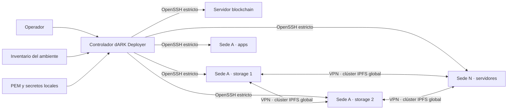
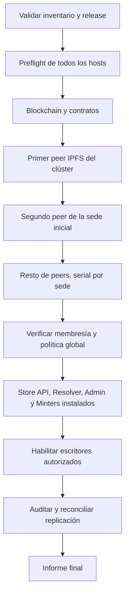

# Propuesta de despliegue remoto para dARK Deployer

## Estado del documento

| Campo | Valor |
| --- | --- |
| Estado | Propuesta técnica; no implementada |
| Decisión recomendada | Controlador sin agente sobre OpenSSH |
| Alcance inicial | Hosts Linux previamente preparados, accesibles por SSH y VPN |
| Fuente de verdad | Un inventario declarativo por ambiente |
| Unidad de despliegue | Release inmutable identificada por commits exactos |
| Relación con IPFS | El inventario genera la topología del único clúster global |

Este documento propone cómo extender dARK Deployer para instalar, actualizar y
verificar los componentes en servidores remotos a partir de nombres DNS o
direcciones IP, usuarios SSH y claves PEM mantenidas en la máquina del
operador.

La propuesta es deliberadamente incremental: reutiliza el instalador local como
motor de cada host y agrega una capa de orquestación. No propone Kubernetes, un
agente residente ni un segundo sistema de configuración para IPFS.

## 1. Resumen ejecutivo

La solución recomendada tiene dos capas:

1. **Controlador de flota**: se ejecuta desde una máquina administrativa de
   confianza, lee el inventario, construye un plan, se conecta por OpenSSH y
   coordina el orden entre hosts.
2. **Ejecutor local**: se ejecuta en cada servidor y aplica de forma no
   interactiva sólo la configuración correspondiente a ese host.



Las claves PEM nunca se copian al servidor. OpenSSH las usa localmente para
autenticar la sesión. Los secretos que sí necesita un servicio remoto —por
ejemplo las claves de la red privada IPFS— se transfieren cifrados por SSH,
atómicamente, con permisos restrictivos y sin mostrarlos en registros.

La primera versión debe asumir que cada servidor ya tiene:

- un sistema Linux soportado;
- Python compatible con el instalador;
- Git;
- Docker Engine y Docker Compose v2;
- un usuario de despliegue con acceso no interactivo a Docker;
- la VPN configurada cuando el rol use almacenamiento o endpoints privados;
- un directorio de despliegue perteneciente a ese usuario.

Esta restricción evita que la primera versión tenga que administrar repositorios
del sistema operativo, paquetes, reinicios del host y permisos generales de
`sudo`. Un comando de *bootstrap* puede agregarse después como fase separada y
explícitamente privilegiada.

## 2. Situación actual del repositorio

El instalador actual ya aporta una base valiosa:

- perfiles `developer`, `sandbox` y `production`;
- roles `blockchain`, `storage-node`, `apps` y `all`;
- validación no mutante mediante `install.py validate`;
- visualización local mediante `install.py plan`;
- selección de repositorios mediante branches configuradas en `.env`;
- validación de secretos IPFS externos y sus permisos;
- generación determinista de configuración por rol;
- auditoría y reconciliación del clúster IPFS global;
- escritura de archivos sensibles con modo `0600`;
- comprobaciones de salud de blockchain, APIs e IPFS.

Sin embargo, hoy la instalación completa sigue siendo una operación local:

- la ejecución normal entra en un asistente interactivo;
- `.env`, `components/`, `venv/` y los artefactos generados pertenecen a una
  única instalación local;
- no existe un comando no interactivo que reciba una configuración de host y
  aplique exactamente ese estado;
- `restart.py` y `stop.py` sólo recorren rutas locales;
- no hay inventario de flota, selectores de hosts, control de concurrencia,
  bloqueo entre despliegues ni reanudación;
- la salida es texto para humanos, no eventos estructurados;
- los componentes siguen branches, por lo que una branch que avance durante
  un despliegue puede producir diferencias entre hosts;
- varios comandos de componentes se ejecutan mediante shell. Ese mecanismo es
  válido para comandos confiables incluidos en la release, pero no debe aceptar
  texto arbitrario proveniente del inventario remoto.

La conclusión es que no conviene enviar el asistente actual por SSH. Primero se
necesita definir un contrato local no interactivo, idempotente y verificable;
después el controlador puede invocarlo de forma segura.

## 3. Objetivos y límites

### 3.1 Objetivos

La solución debe:

- describir toda la infraestructura de un ambiente en un inventario validable;
- aceptar DNS o IP por host, puerto SSH, usuario y referencia a una PEM;
- usar la misma descripción para roles de despliegue y topología IPFS;
- instalar una release idéntica en todos los hosts seleccionados;
- calcular y mostrar el plan antes de modificar servidores;
- ejecutar por fases y detenerse ante fallos que comprometan la consistencia;
- permitir `--site`, `--role` y `--limit` sin crear inventarios alternativos;
- poder reanudarse después de la caída del controlador o de un host;
- verificar salud técnica y invariantes de arquitectura, no sólo el código de
  salida de un comando;
- minimizar privilegios y exposición de credenciales;
- conservar un rastro auditable y redactado de cada despliegue;
- soportar una sede inicial y la expansión posterior a N sedes.

### 3.2 No objetivos iniciales

La primera versión no debe:

- provisionar máquinas virtuales o redes;
- crear la VPN;
- instalar o actualizar el sistema operativo;
- actuar como gestor general de secretos;
- resolver balanceo global de APIs;
- automatizar una recuperación destructiva de datos;
- hacer `unpin`, borrar volúmenes o limpiar hosts como parte de un rollback;
- resolver por sí sola múltiples Minters activos con la misma cuenta
  blockchain;
- reemplazar herramientas de observabilidad o backup.

## 4. Alternativas analizadas

| Alternativa | Ventajas | Costes y riesgos | Decisión |
| --- | --- | --- | --- |
| Controlador propio sobre OpenSSH | Pocas dependencias, reutiliza Python y el instalador, PEM local, comportamiento específico de dARK | Hay que implementar plan, estado, reanudación y concurrencia | **Recomendada** |
| Ansible | Inventario, selectores, ejecución serial, *check mode* y ecosistema maduros | Agrega runtime y DSL; puede duplicar la lógica de idempotencia del instalador | Posible backend futuro |
| Agente residente en cada host | Ejecución *pull*, telemetría y trabajo asincrónico | Más servicios, credenciales, actualizaciones y superficie de ataque | Descartada |
| Kubernetes | Despliegues declarativos, *rollouts* y secretos integrados | Cambia toda la plataforma y aumenta mucho la infraestructura por sede | Fuera de alcance |
| Ejecutar comandos SSH manuales | Implementación inicial mínima | Sin fuente de verdad, orden, reanudación, seguridad uniforme ni auditoría | Descartada |

Ansible demuestra que inventario, selección de subconjuntos, modo de
comprobación y lotes seriales son abstracciones útiles. La propuesta adopta
esas capacidades, pero no incorpora Ansible en la primera versión porque el
proyecto ya contiene el conocimiento de instalación en Python. Si más adelante
dARK debe preparar sistemas operativos heterogéneos o integrarse con un CMDB,
el inventario podrá alimentar un backend Ansible sin modificar el modelo de
roles.

Referencias oficiales:

- [Inventarios y selección de hosts en Ansible](https://docs.ansible.com/projects/ansible/latest/inventory_guide/index.html)
- [Check mode y diff mode](https://docs.ansible.com/projects/ansible/latest/playbook_guide/playbooks_checkmode.html)

## 5. Arquitectura propuesta

### 5.1 Controlador sin agente

El controlador se ejecuta sólo cuando un operador o una automatización inicia
un despliegue. Utiliza los binarios `ssh` y `scp`/`sftp` del sistema, no una
implementación SSH embebida.

Esto permite reutilizar:

- `~/.ssh/config` cuando se autorice;
- `ssh-agent` y hardware keys;
- `ProxyJump` para sedes detrás de bastiones;
- `known_hosts` y políticas corporativas;
- multiplexación de conexiones de OpenSSH;
- certificados SSH, si se incorporan posteriormente.

No queda ningún proceso dARK Deployer escuchando en los servidores. El único
plano de control remoto es SSH, que ya debe existir para administrar los hosts.

### 5.2 Ejecutor local

El ejecutor local recibe un archivo ya renderizado y validado para un host. No
decide qué otros hosts existen ni lee la PEM del operador. Su contrato debe ser:

```bash
python3 install.py host validate --config /opt/dark-deployer/config/host.json --json
python3 install.py host plan --config /opt/dark-deployer/config/host.json --json
python3 install.py host apply --config /opt/dark-deployer/config/host.json \
  --deployment-id 20260801T120000Z-a1b2c3d4 --json
python3 install.py host status --config /opt/dark-deployer/config/host.json --json
```

Propiedades obligatorias:

- no solicita entrada por terminal;
- `validate` y `plan` no mutan archivos, repositorios ni contenedores;
- `apply` es repetible y converge al mismo resultado;
- devuelve eventos JSON Lines además de una vista humana opcional;
- utiliza códigos de salida estables;
- bloquea otra aplicación simultánea en el mismo host;
- registra una constancia local de la release aplicada;
- nunca muestra secretos.

El asistente interactivo puede seguir sirviendo al perfil de desarrollo local,
pero no forma parte del camino remoto.

### 5.3 Separación de módulos

No se recomienda continuar concentrando toda la lógica en `install.py`. Una
organización posible es:

```text
dark_deployer/
├── host/
│   ├── config.py
│   ├── planner.py
│   ├── apply.py
│   ├── health.py
│   └── receipt.py
├── fleet/
│   ├── inventory.py
│   ├── planner.py
│   ├── ssh.py
│   ├── transfer.py
│   ├── executor.py
│   ├── state.py
│   └── report.py
├── process.py
├── storage.py
└── secrets.py
```

`install.py` puede quedar como fachada del ejecutor local y un nuevo
`deploy.py` como fachada pública de la flota.

## 6. Inventario: una sola fuente de verdad

Se recomienda JSON para la primera versión porque el repositorio ya depende de
`jsonschema` y usa JSON para la topología IPFS. Esto evita agregar un parser y
las ambigüedades de tipos que puede introducir YAML. Si se ofrece YAML en el
futuro, ambos formatos deben validar contra el mismo esquema.

El inventario contiene estado deseado, no secretos. Puede referenciar rutas o
variables de entorno, pero no debe incluir el contenido de una PEM, una clave
blockchain o un secreto IPFS.

Ejemplo conceptual:

```json
{
  "version": 1,
  "environment": "production",
  "deployer_branch": "codex/production-deployment-readiness",
  "ssh": {
    "known_hosts_file": "${DARK_KNOWN_HOSTS}",
    "connect_timeout_seconds": 10,
    "defaults": {
      "port": 22,
      "user": "darkdeploy",
      "identity_file": "${DARK_SSH_IDENTITY}"
    }
  },
  "storage": {
    "cluster_name": "dark-global",
    "swarm_key_file": "${DARK_IPFS_SWARM_KEY_FILE}",
    "cluster_secret_file": "${DARK_IPFS_CLUSTER_SECRET_FILE}"
  },
  "sites": [
    {
      "id": "site-a",
      "hosts": [
        {
          "id": "site-a-storage-1",
          "address": "storage-1.site-a.example.org",
          "vpn_address": "10.200.1.11",
          "roles": ["storage-node"]
        },
        {
          "id": "site-a-storage-2",
          "address": "10.10.1.12",
          "vpn_address": "10.200.1.12",
          "roles": ["storage-node"]
        },
        {
          "id": "site-a-apps-1",
          "address": "apps-1.site-a.example.org",
          "roles": ["apps"],
          "minter": {
            "signer_group": "production-mint",
            "chain_worker": "active"
          }
        }
      ]
    }
  ]
}
```

La interpolación debe aceptar únicamente la forma `${VARIABLE}` y nunca
evaluar shell, sustituciones de comandos o expresiones. Una variable ausente es
un error de validación.

### 6.1 Reglas de consistencia

Antes de abrir una conexión, el validador debe comprobar:

- identificadores únicos de ambientes, sedes y hosts;
- una dirección de administración válida por host;
- roles conocidos y combinaciones permitidas;
- exactamente dos hosts `storage-node` por sede productiva;
- una `vpn_address` IPv4 única por nodo de almacenamiento;
- al menos un host de blockchain o un RPC externo explícito;
- referencias existentes y permisos seguros para PEM y secretos locales;
- nombres de branch no vacíos para el deployer y cada componente requerido;
- coincidencia entre las branches configuradas y los componentes de cada rol;
- que cada host de aplicaciones apunte a su propia sede;
- que la topología IPFS derivada incluya todos y sólo los `storage-node`;
- que no haya dos escritores blockchain activos en el mismo `signer_group`,
  salvo que se declare un mecanismo externo de coordinación soportado.

### 6.2 Topología IPFS derivada

`storage-topology.json` no debe editarse por separado. El controlador lo genera
del inventario y entrega el mismo contenido a todos los nodos IPFS y a todas
las Store API.

Así se evita esta clase de error:

```text
Inventario de despliegue: 6 storage nodes
Topología de un host:      4 storage peers
Store API de otra sede:    2 peers esperados
```

Cada archivo renderizado debe incluir el hash del inventario y el identificador
de release que lo originó. Un host con un hash diferente queda en estado
`drifted` y no puede participar en una promoción de producción hasta
reconciliarse.

## 7. Modelo de release y artefactos

### 7.1 Identidad del despliegue

Un despliegue de producción debe registrar:

- branch de dARK Deployer;
- URL sin credenciales y branch de cada componente;
- versión del esquema de inventario;
- hash del inventario normalizado;
- hash de los archivos públicos renderizados;
- versión mínima del contrato host-local.

El controlador debe rechazar una configuración si falta una branch requerida
o si el checkout del deployer no coincide con `DEPLOYER_BRANCH`. El hash del
`.env.public` permite detectar diferencias de configuración entre hosts.

### 7.2 Entrega recomendada para V1

Para mantener la primera versión simple:

1. el controlador empaqueta el checkout de la branch configurada del deployer;
2. lo transfiere al host y verifica el SHA-256 del artefacto;
3. los hosts obtienen cada componente usando las branches configuradas en
   `.env`;
4. las credenciales de repositorios privados se resuelven mediante un mecanismo
   Git previamente configurado en el host, nunca dentro de la URL o del log.

Esto requiere salida Git desde los hosts. Como fase posterior se puede agregar
un modo `bundle`, donde el controlador descarga una vez todos los repositorios
y envía un artefacto autocontenido para redes cerradas.

### 7.3 Directorios remotos

```text
/opt/dark-deployer/
├── releases/
│   └── 20260801T120000Z-a1b2c3d4/
├── config/
│   ├── host.json
│   └── storage-topology.json
├── secrets/
├── state/
├── current -> releases/20260801T120000Z-a1b2c3d4
└── apply.lock
```

El usuario de despliegue es propietario de esta jerarquía. Los datos
persistentes permanecen en volúmenes Docker o directorios estables fuera de la
release. Los proyectos Compose deben tener nombres fijos para que cambiar el
enlace `current` no cree volúmenes o redes nuevos accidentalmente.

La activación de una release es un cambio atómico del enlace `current`, seguido
de la aplicación y verificación de los servicios. La release anterior no se
borra automáticamente.

## 8. Seguridad SSH

### 8.1 Identidad del servidor

El controlador debe usar:

- `StrictHostKeyChecking=yes`;
- un `UserKnownHostsFile` explícito por ambiente;
- `BatchMode=yes` para no quedar esperando contraseñas;
- `IdentitiesOnly=yes` cuando se configura una identidad concreta;
- `ConnectTimeout` y keepalives acotados;
- `ProxyJump` sólo cuando el inventario lo declare;
- algoritmos y políticas heredados de la configuración corporativa de
  OpenSSH, sin desactivaciones globales.

La huella del host debe obtenerse por un canal confiable —provisionador,
consola, CMDB o comunicación con un administrador— y cargarse antes del primer
despliegue. `ssh-keyscan` puede ayudar a recolectar claves, pero no las autentica:
crear `known_hosts` con su salida sin verificar la huella permite un ataque de
intermediario.

Referencias oficiales:

- [Opciones de ssh_config de OpenSSH](https://man.openbsd.org/ssh_config)
- [Advertencia de seguridad de ssh-keyscan](https://man.openbsd.org/ssh-keyscan)

### 8.2 Claves PEM

Las PEM:

- permanecen en la máquina controladora;
- deben ser archivos regulares, no enlaces inesperados;
- no pueden tener permisos para grupo u otros;
- se pasan a OpenSSH mediante `IdentityFile`/`-i` o se cargan previamente en
  `ssh-agent`;
- nunca se leen para imprimirlas, copiarlas o incluirlas en un manifiesto;
- nunca se suben a `/opt/dark-deployer`;
- pueden variar por host mediante una sobreescritura explícita.

El informe de plan puede mostrar la ruta redactada o sólo su huella local, pero
nunca el contenido.

### 8.3 Construcción segura de comandos

Toda invocación local debe usar listas de argumentos con `subprocess`, no
concatenación de shell. El comando remoto debe estar formado por verbos y rutas
internas permitidas. Identificadores de despliegue, host y sede deben validar
contra una expresión estricta antes de usarse.

El inventario no puede definir comandos arbitrarios. Los `*_COMMANDS_JSON`
actuales sólo pueden provenir de una release confiable y revisada. Antes de la
implementación remota, `run_shell` debe aplicar la misma redacción de
credenciales que `run_command`, y los secretos nunca deben viajar como
argumentos de proceso.

## 9. Distribución de secretos

### 9.1 Principio de mínimo conocimiento

Cada host recibe sólo lo que necesita:

| Rol | Secretos posibles |
| --- | --- |
| `storage-node` | Swarm key de Kubo y secreto del clúster IPFS global |
| `apps` | Claves de los roles de aplicación asignados a ese host |
| `blockchain` | Clave de despliegue inicial si se despliegan contratos |
| controlador | Referencias a todos los secretos requeridos por la operación |

Store API no necesita la PEM SSH ni las claves privadas de Kubo/Cluster para
llamar a los endpoints privados. Un nodo IPFS no necesita claves de firma
blockchain.

### 9.2 Protocolo de entrega

Para cada archivo secreto:

1. validar localmente existencia, tipo, permisos y formato sin mostrarlo;
2. abrir el directorio remoto con permisos restrictivos;
3. transferir a un nombre temporal impredecible por el canal SSH;
4. asignar propietario y modo `0600`;
5. verificar el hash por ambos extremos sin registrar el contenido;
6. renombrar atómicamente al nombre final;
7. eliminar el temporal si la operación falla;
8. registrar sólo identificador lógico, versión y estado de entrega.

No se debe insertar secretos en variables de entorno del proceso `ssh`, línea
de comandos, salida JSON o excepciones. Los archivos `.env` que mezclen
configuración pública y secretos deben separarse durante esta refactorización.

La rotación coordinada de los dos secretos IPFS globales afecta a todas las
sedes y merece un procedimiento específico. No debe quedar incluida
implícitamente en un `apply` ordinario.

## 10. Privilegios y preparación de hosts

### 10.1 Contrato de host preparado

La V1 comprueba y exige, pero no instala:

- usuario de despliegue existente y bloqueado para autenticación por password
  cuando la política local lo permita;
- clave pública autorizada o certificado SSH;
- Python 3.10–3.12 para compatibilidad con las dependencias actuales;
- Docker y Compose v2 operativos;
- pertenencia efectiva al grupo o mecanismo que permita usar Docker;
- Git y espacio libre suficiente;
- reloj sincronizado;
- directorio `/opt/dark-deployer` propiedad del usuario;
- firewall y VPN ya configurados.

Debe recordarse que acceso al daemon Docker equivale prácticamente a privilegio
de administrador del host. El usuario de despliegue no es un usuario de bajo
impacto sólo por no usar `sudo`.

### 10.2 Bootstrap posterior

Una fase futura puede ofrecer:

```bash
python3 deploy.py bootstrap --inventory inventory/production.json --limit host-id
```

Ese comando será independiente de `apply`, requerirá confirmación y usará
`sudo -n` con acciones acotadas y visibles en el plan. No debe solicitar una
contraseña de `sudo` en medio de una ejecución de flota ni instalar paquetes de
forma implícita.

## 11. Interfaz del controlador

La interfaz pública propuesta es:

```bash
python3 deploy.py validate --inventory inventory/production.json
python3 deploy.py plan --inventory inventory/production.json
python3 deploy.py preflight --inventory inventory/production.json
python3 deploy.py apply --inventory inventory/production.json
python3 deploy.py status --inventory inventory/production.json
python3 deploy.py resume --deployment-id 20260801T120000Z-a1b2c3d4
```

Selectores:

```bash
python3 deploy.py plan --inventory inventory/production.json --site site-b
python3 deploy.py apply --inventory inventory/production.json --role storage-node
python3 deploy.py apply --inventory inventory/production.json --limit site-b-storage-2
```

Semántica:

- `validate`: sólo esquema, referencias locales e invariantes globales;
- `plan`: renderiza cambios esperados, orden y alcance, sin conectarse salvo que
  se solicite comparar estado remoto;
- `preflight`: read-only sobre SSH; comprueba identidad, runtime, red y estado;
- `apply`: crea una release, aplica fases y verifica salud;
- `status`: consulta release, drift, servicios y salud;
- `resume`: continúa exactamente el mismo manifiesto, no recalcula contra una
  rama más nueva.

No debe existir un `--force` genérico. Las excepciones peligrosas tienen que ser
específicas, por ejemplo `--allow-single-site-write` o
`--acknowledge-topology-change`, con el motivo registrado.

## 12. Planificación y orden de despliegue

El plan debe ser un grafo de dependencias, no un bucle por la lista de hosts.



### 12.1 Despliegue inicial

1. Validar todo el inventario, incluso si se selecciona un subconjunto.
2. Ejecutar preflight en todos los hosts implicados.
3. Desplegar blockchain y contratos o validar el RPC externo.
4. Iniciar el primer peer definido de IPFS Cluster.
5. Esperar identidad y salud del seed.
6. Iniciar el segundo peer de la misma sede y comprobar que ambos se ven.
7. Agregar pares de almacenamiento de otras sedes, un host a la vez por sede.
8. Comprobar el número esperado de peers y las identidades únicas.
9. Desplegar Store API y demás aplicaciones por sede.
10. Ejecutar una prueba de escritura, confirmación de réplicas y lectura local.
11. Habilitar sólo los Minters autorizados como escritores.
12. Guardar el informe y la constancia remota.

### 12.2 Incorporación de una sede

Una expansión cambia el número esperado de peers y el máximo de replicación.
Debe tratarse como operación coordinada:

1. validar el inventario futuro completo;
2. comprobar que el clúster existente está sano antes del cambio;
3. renderizar la topología futura con un nuevo hash;
4. desplegar el primer nodo de la nueva sede contra peers existentes;
5. desplegar su compañero local;
6. confirmar membresía, conectividad y capacidad de pin;
7. distribuir la nueva topología a los peers y Store API existentes;
8. reconciliar los pins para alcanzar el nuevo máximo;
9. esperar la política de durabilidad definida;
10. habilitar las aplicaciones de la nueva sede.

El controlador debe ofrecer una compuerta temporal de escritura durante el
cambio de política si la consistencia entre Store API no puede garantizarse.
Nunca debe quedar una parte de las sedes aceptando escrituras con una topología
y otra parte evaluando otra.

### 12.3 Actualizaciones ordinarias

- blockchain: una instancia a la vez y con verificación de altura/RPC;
- almacenamiento: un peer a la vez, manteniendo la política mínima;
- Store API: por sede, después de confirmar sus dos endpoints locales;
- Resolver y Admin: lotes limitados por sede;
- Minter: instalar primero con workers de escritura detenidos, verificar y
  activar según la política del signer.

## 13. Minters por sede

El inventario puede instalar un Minter en cada sede, pero “instalado y sano” no
significa necesariamente “escritor activo”. La arquitectura IPFS resuelve la
disponibilidad de metadatos; no resuelve el orden de nonces de blockchain.

Hasta implementar un coordinador de nonces o firmantes separados autorizados:

- puede haber un Minter desplegado por sede;
- sólo uno debe tener el worker blockchain activo para un mismo
  `signer_group`;
- los demás quedan `standby` y pueden activarse mediante una operación de
  *failover* explícita;
- la activación debe verificar que el anterior escritor está detenido o que
  existe un mecanismo externo de exclusión;
- el controlador debe rechazar por defecto dos `active` para la misma cuenta.

Si cada sede tiene una cuenta de firma distinta y el contrato autoriza cada una,
el inventario puede declarar grupos distintos. Esa decisión requiere una
revisión de la lógica de autorización y no debe inferirse sólo porque las claves
sean diferentes.

## 14. Estado, idempotencia y reanudación

### 14.1 Identidad de despliegue

Cada ejecución mutante recibe un `deployment_id` compuesto por fecha UTC y una
porción del hash del manifiesto. Todos los eventos, archivos y comprobaciones
usan ese identificador.

El controlador conserva:

```text
.dark-fleet/
└── production/
    └── deployments/
        └── 20260801T120000Z-a1b2c3d4/
            ├── manifest.json
            ├── plan.json
            ├── events.jsonl
            └── result.json
```

Este estado contiene hashes y resultados, no secretos. Debe estar ignorado por
Git y poder exportarse a un almacén de auditoría.

Cada host conserva una constancia con:

- release instalada y activa;
- hash del inventario y de la configuración del host;
- fases terminadas;
- imágenes/commits observados;
- resultado de salud;
- fecha y controlador que aplicó el cambio.

### 14.2 Operaciones por fase

Cada fase implementa:

```text
check -> apply sólo si hace falta -> verify -> receipt
```

Una reanudación lee el manifiesto original y las constancias. No repite fases
verificadas, pero vuelve a consultar salud antes de depender de ellas. Si el
inventario actual cambió, exige iniciar otro despliegue.

### 14.3 Bloqueos

- un lock local evita dos controladores usando el mismo directorio de estado;
- un lock remoto evita dos `apply` simultáneos sobre el mismo host;
- el lock incluye PID, deployment ID, inicio y tiempo máximo;
- un lock huérfano no se elimina automáticamente sin comprobar el proceso y
  registrar la recuperación.

## 15. Preflight y verificación

### 15.1 Comprobaciones por host

- resolución DNS y conexión SSH;
- huella SSH conocida;
- usuario y grupos efectivos;
- sistema, arquitectura, Python, Git, Docker y Compose compatibles;
- daemon Docker accesible;
- espacio e inodos libres en rutas de release y datos;
- reloj razonablemente sincronizado;
- directorios con propietario y permisos correctos;
- puertos requeridos libres o pertenecientes al stack esperado;
- `vpn_address` realmente presente en una interfaz del host;
- ausencia de otro despliegue activo;
- configuración anterior legible y estado de los contenedores.

### 15.2 Matriz de red

El controlador debe verificar desde el origen correcto, no sólo desde su propia
máquina:

- SSH: controlador hacia cada host;
- Kubo `4001` TCP/UDP: todos los storage nodes entre sí por VPN;
- Cluster `9096` TCP/UDP: todos los storage nodes entre sí por VPN;
- Kubo API `5001`, Cluster API `9094` y proxy `9095`: apps hacia los dos peers
  locales autorizados;
- Store API `8003`: Minter y Resolver locales;
- RPC blockchain: cada aplicación que lo consuma;
- repositorios/registry: cada host, si V1 descarga componentes e imágenes.

Una conexión TCP correcta no demuestra UDP. La prueba de aceptación debe
incluir conectividad libp2p observada, no sólo un `connect()` al puerto.

### 15.3 Salud semántica

| Rol | Verificación mínima |
| --- | --- |
| Blockchain | RPC responde, chain ID esperado, contratos esperados y avance de bloques |
| Storage | Kubo y Cluster sanos, peer ID único, peer name correcto, cluster name correcto, membresía esperada |
| Store API | dos endpoints locales configurados, peers/sedes esperados y prueba de confirmación de réplica |
| Resolver | health, acceso a blockchain y resolución de un CID de prueba |
| Minter | API sana, workers en el modo declarado y signer esperado sin exponerlo |
| Dashboard/Admin | health y dependencias alcanzables |

El resultado global es exitoso sólo si también pasa `storage audit`. “Todos los
contenedores están running” no es criterio suficiente.

## 16. Concurrencia y política de fallos

La concurrencia debe ser conservadora y configurable por rol:

- preflight: paralelo con un límite global;
- almacenamiento: serial dentro de una sede y con presupuesto de fallos cero;
- aplicaciones: paralelo entre sedes, serial dentro de cada sede al inicio;
- blockchain: serial;
- activación de Minter: serial por `signer_group`.

| Fallo | Comportamiento propuesto | Recuperación |
| --- | --- | --- |
| DNS o SSH inaccesible | No mutar ese host; detener si es dependencia | Corregir red y `resume` |
| Huella SSH cambió | Abort inmediato, sin opción automática de aceptar | Verificar por canal externo y actualizar `known_hosts` |
| Preflight falla | No iniciar la fase mutante dependiente | Preparar host y repetir |
| Transferencia parcial | No activar release; limpiar temporal | Reintentar misma release |
| Controlador cae | Host termina o falla su fase; constancia queda local | `resume` con el mismo manifiesto |
| Host cae durante `apply` | Detener dependientes; no asumir rollback | Recuperar host y verificar antes de reanudar |
| Peer IPFS no se une | No desplegar Store API contra la nueva topología | Corregir identidad/red/secreto y reintentar |
| Réplicas bajo mínimo | Bloquear promoción y Minters escritores | Reconciliar y esperar durabilidad |
| Apps fallan en una sede | Mantener otras sedes; no activar su Minter | Revertir release de apps o corregir |
| Partición entre sedes | No cambiar topología automáticamente | Operar con política existente y revisar quorum |
| Otro despliegue activo | Rechazar con código de lock | Esperar o recuperar lock huérfano explícitamente |

La ejecución por defecto es *fail fast* para dependencias, pero el informe debe
mostrar todos los fallos de preflight descubiertos en paralelo.

## 17. Rollback

El rollback automático sólo es seguro para código y configuración compatibles:

1. detener la activación de nuevos escritores;
2. seleccionar la release anterior conservada;
3. restaurar su configuración pública y referencias de secretos;
4. ejecutar Compose con nombres estables;
5. verificar salud y política de almacenamiento;
6. registrar una nueva operación de rollback.

No se permite rollback automático de:

- migraciones de base de datos no reversibles;
- contratos blockchain;
- identidad o volúmenes Kubo/Cluster;
- eliminación de pins;
- rotación de secretos globales;
- reducción de la topología IPFS.

Las migraciones deben declararse `backward-compatible`, `forward-only` o
`manual`. El plan rechaza un rollback cuando la release no declara
compatibilidad.

## 18. Observabilidad, auditoría y códigos de salida

Cada evento JSONL debe contener como mínimo:

```json
{
  "timestamp": "2026-08-01T12:00:00Z",
  "deployment_id": "20260801T120000Z-a1b2c3d4",
  "host": "site-a-storage-1",
  "phase": "storage.health",
  "status": "succeeded",
  "changed": false,
  "duration_ms": 412
}
```

Nunca incluirá variables completas, URLs con credenciales, contenido de
archivos secretos ni salida sin redactar de herramientas externas.

Códigos de salida propuestos:

| Código | Significado |
| ---: | --- |
| `0` | Éxito completo |
| `2` | Inventario, configuración o política inválida |
| `3` | Ejecución parcial; reanudable |
| `4` | Autenticación o identidad SSH fallida |
| `5` | Transporte o red fallida |
| `6` | Ejecución remota fallida |
| `7` | Despliegue bloqueado por otra operación |
| `8` | Servicios activos pero salud o durabilidad insuficiente |

## 19. Estrategia de pruebas

### 19.1 Unitarias

- esquema e invariantes del inventario;
- interpolación limitada de variables;
- generación única de `storage-topology.json`;
- DAG y orden por rol;
- selectores y dependencias implícitas;
- validación de fingerprints, rutas y permisos;
- construcción de argumentos SSH sin inyección;
- redacción de PEM, tokens, URLs y archivos `.env`;
- máquina de estados y reanudación;
- códigos de salida y reportes parciales.

### 19.2 Integración

- hosts efímeros con `sshd` y claves diferentes;
- éxito y rechazo de host keys;
- `ProxyJump`;
- transferencia atómica interrumpida;
- dos controladores compitiendo por el lock;
- caída del controlador entre `apply` y `verify`;
- despliegue bloqueado por branch ausente;
- repositorio o branch inaccesible;
- ejecución repetida sin cambios.

### 19.3 Laboratorio de infraestructura

Antes de producción se necesita al menos un laboratorio de dos sedes y cuatro
storage nodes que valide:

- instalación desde cero;
- pérdida de un storage node;
- pérdida de una sede completa;
- reincorporación de una sede;
- expansión de una a dos sedes;
- actualización serial de todos los peers;
- escritura, replicación y lectura desde cada sede;
- `storage audit` y `storage reconcile`;
- failover controlado del Minter;
- rollback de una aplicación sin tocar datos IPFS.

## 20. Fases de implementación

### Fase 0 — Contrato local

- extraer lógica de `install.py` a módulos reutilizables;
- agregar `host validate`, `host plan`, `host apply` y `host status`;
- eliminar prompts del camino host-local;
- incorporar salida JSONL, códigos estables y lock;
- asegurar redacción uniforme de procesos;
- probar idempotencia local.

**Resultado:** una automatización externa puede operar un host sin emular un
terminal.

### Fase 1 — Inventario y planificación de flota

- definir JSON Schema versionado;
- implementar inventario, interpolación segura y selectores;
- generar la topología IPFS;
- exigir locks de componentes en producción;
- producir DAG y plan redactado;
- implementar `validate`, `plan` y `preflight`.

**Resultado:** visibilidad completa sin mutar servidores.

### Fase 2 — Aplicación remota mínima

- OpenSSH estricto;
- transferencia y verificación de release/configuración/secretos;
- `apply --limit` para un host;
- constancias locales y remotas;
- `status` y reanudación básica.

**Resultado:** despliegue seguro y repetible de un servidor preparado.

### Fase 3 — Orquestación por roles y sedes

- DAG completo;
- límites de concurrencia;
- bootstrap del primer clúster;
- incorporación de sedes;
- verificaciones de membresía y Store API;
- gating de Minters;
- auditoría final global.

**Resultado:** despliegue de la infraestructura completa de N sedes.

### Fase 4 — Operación y upgrades

- actualizaciones seriales;
- rollback compatible;
- mejor reanudación;
- detección de drift;
- informes exportables;
- simulacros automatizados no destructivos.

### Fase 5 — Extensiones opcionales

- `bootstrap` privilegiado;
- bundles offline;
- integración con Vault u otro secret manager;
- inventario dinámico/CMDB;
- backend Ansible;
- certificados SSH de corta duración;
- integración con métricas y alertas.

## 21. Alcance mínimo recomendado

La primera entrega útil no debe intentar resolver toda la flota. El corte
mínimo es:

1. `host apply` no interactivo e idempotente;
2. inventario validado y topología IPFS derivada;
3. `deploy.py validate`, `plan` y `preflight`;
4. `deploy.py apply --limit <host>`;
5. OpenSSH estricto con PEM local;
6. deployer y componentes seleccionados por branch;
7. transferencia atómica de secretos;
8. estado, lock, health y reporte redactado.

Una vez que ese camino sea confiable, se agrega el DAG multi-host. Esta
secuencia evita esconder problemas locales de idempotencia dentro de una
orquestación distribuida.

## 22. Criterios de aceptación

La funcionalidad se considera lista para producción cuando:

- un operador puede desplegar un host nuevo sin responder prompts;
- una segunda ejecución sobre el mismo manifiesto no cambia nada;
- dos hosts del mismo rol terminan en commits e imágenes equivalentes;
- una PEM nunca aparece en el host ni en logs;
- una host key desconocida o cambiada detiene el proceso;
- un secreto parcialmente transferido nunca se activa;
- una caída del controlador puede recuperarse con `resume`;
- no pueden ejecutarse dos `apply` simultáneos en un host;
- la expansión de sede conserva un único clúster global;
- Store API recibe la topología derivada, no una copia editada;
- el despliegue falla si el clúster queda bajo la política mínima;
- el sistema no activa dos escritores del mismo signer por accidente;
- rollback no elimina volúmenes, identidades o pins;
- todos los escenarios del laboratorio de cuatro nodos están documentados y
  repetidos con éxito.

## 23. Decisiones pendientes antes de implementar

La arquitectura general no depende de estas respuestas, pero la especificación
de V1 sí:

1. ¿Qué distribución y versiones de Linux se soportarán oficialmente?
2. ¿Todos los hosts podrán acceder a Git y a los registries, o hace falta el
   bundle offline desde el inicio?
3. ¿Las sedes requieren bastiones/`ProxyJump`?
4. ¿Dónde se verifican y custodian las huellas SSH iniciales?
5. ¿Los inventarios de producción se versionarán en este repositorio o en uno
   privado de infraestructura?
6. ¿Qué secret manager existe, si existe alguno?
7. ¿Cada sede tendrá un único servidor de apps o también redundancia local?
8. ¿Los Minters usarán una cuenta compartida con failover o cuentas separadas?
9. ¿Quién autoriza la compuerta de escritura al cambiar topología?
10. ¿Cuánto tiempo debe conservarse una release anterior y su reporte?

## 24. Recomendación final

Implementar un controlador dARK Deployer propio, sin agente, sobre OpenSSH y
con hosts previamente preparados. El inventario debe ser la única fuente de
verdad de infraestructura e IPFS; las PEM permanecen en el controlador; los
secretos se distribuyen por archivo de forma atómica; y toda producción se
despliega mediante commits exactos.

El primer trabajo no es “hacer SSH a muchos servidores”, sino convertir el
instalador local en un ejecutor no interactivo, idempotente y observable. Con
ese contrato estable, la orquestación multi-sede se vuelve una composición de
operaciones verificables y puede crecer sin introducir infraestructura
permanente adicional en cada nodo.
